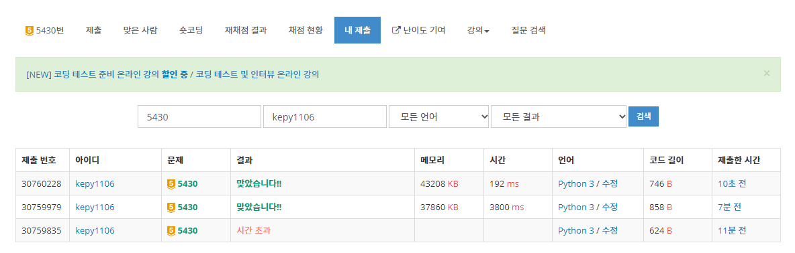

# 210707


[TOC]


## 도커와 쿠버네티스


### 서버를 관리하는 방식의 변화

1. 사무실 내에 별도의 서버
   1. 자체 서버 운영
   2. 설정 관리 도구
   3. 가상머신
2. 외부 서버 사용
   1. 클라우드
   2. PaaS
   3. 도커
   4. 쿠버네티스
   5. 서비스메시


#### 1. 자체 서버 운영

> 사무실 내에서 서버를 직접 하나하나 운영하는 것

**단점**

- 모든 세팅을 직접 해주어야 한다.
- 인수인계 시 작업 내용 공유가 제대로 되기 힘들다. (방대한 양의 작업 내용)


**"아! 설정 일일히 다 하는 거 너무 힘든데, 자동으로 해주면 참 좋겠다."**


#### 2. 설정 관리 도구

> 설정 관리란 컴퓨터 시스템, 서버 및 소프트웨어를 바람직한 상태로 일관되게 유지관리하는 프로세스로, 시간이 지나면서 다양한 변경 사항이 적용되더라도 시스템이 계속 정상적으로 작동하도록 합니다.
>
> Ansible 등

**단점**

- 환경이 다른 서버에 똑같은 설정을 해줘도 제대로 작동하지 않는다.


**"어떤 환경에서도 안정적으로 동작했으면 좋겠다."**


#### 3. 가상머신 등장

> Vitualbox

단점

- 너무 느려!!


#### 4. 클라우드 서버

> AWS, Azure 등


#### 5. PaaS (Netlify, Heroku 등)

- 앱을 PaaS 방식에 맞게 작성
- 서버에 대한 원격 접속 시스템을 제공하지 않음
- 서버에 파일 시스템을 사용할 수 없음
- Site 패키지를 설치할 수 없음
- Log 수집을 제한적인 방식으로 허용 (STDOUT)


이걸 할 수 있을까?

- 크론잡 (문자 발송, 예약, 정산 등)
- 데이터 분석 (BigQuery, S3 등 연동)
- 로그 분석 (엘라스틱 서치, 스택 드라이버, 클라우드와치 등)
- 애플리케이션 성능 모니터링
- A/B 테스트, Canary 배포
- 네트워크, 스토리지 설정


#### 6. Docker

- 가상머신처럼 독립적으로 실행
- 가상머신보다 빠르고, 쉽고, 효율적


- 클라우드 이미지보다 관리하기 쉬움
- 다른 프로세스와 격리되어 가상머신처럼 사용하지만 성능저하가 (거의) 없음
- 복잡한 기술을 몰라도 사용 가능
- 이미지 빌드 기록이 남음
- 코드와 설정으로 관리 > 재현 및 수정 가능
- 오픈소스 > 특정 회사 기술에 종속적이지 않음


하지만,

언제 이 많은 컨테이너를 관리하지?


#### 7. Kubernetes

> 컨테이너 오케스트레이션

다음...


## 알고리즘


### 백준 - 5430 (AC)

[큐덱 - AC](https://www.acmicpc.net/problem/5430)

#### 내 코드 (성능 🤣)

```python
import sys

TC = int(sys.stdin.readline().strip())

for tc in range(TC):
    operations = sys.stdin.readline().strip()
    N = int(sys.stdin.readline().strip())
    NUMS = sys.stdin.readline().strip()[1:-1]
    direction = True
    if len(NUMS) < 1:
        num_list = []
    else:
        num_list = list(map(int, NUMS.split(",")))
    for operation in operations:
        if operation == "R":
            direction = not direction
        elif operation == "D":
            if len(num_list) < 1:
                print("error")
                break
            if direction:
                num_list.pop(0)
            else:
                num_list.pop()
    else:
        if not direction:
            num_list = num_list[::-1]
        print(f"[{','.join(list(map(str, num_list)))}]")
```


#### 다른 분 코드 참고 (성능 😍)

```python
for tc in range(TC):
    operations = sys.stdin.readline().strip()
    N = int(sys.stdin.readline().strip())
    NUMS = sys.stdin.readline().strip()[1:-1].split(",")
    is_front_pop = True
    start_idx = 0
    end_idx = N
    for operation in operations:
        if operation == "R":
            is_front_pop = not is_front_pop
        else:
            if end_idx <= start_idx:
                print("error")
                break
            if is_front_pop:
                start_idx += 1
            else:
                end_idx -= 1
    else:
        answer = NUMS[start_idx:end_idx]
        if not is_front_pop:
            answer = answer[::-1]

        print(f"[{','.join(answer)}]")
```


**성능 차이**

> Why?
>
> 내가 처음에 짠 코드는 매번 배열의 길이에 변화를 주는, 특히 pop(0)과 같이 시간이 오래걸리는 연산을 했기 때문이다.
>
> 배열의 양쪽 끝에 변화가 생긴다면, 양 끝 인덱스를 조작하는 것으로 대체할 수 있다는 생각을 해야겠다.




### 백준 - 2630 (색종이 만들기)

[링크](https://www.acmicpc.net/problem/2630)

#### 이론

- 쿼드트리


#### 내 코드

```python
# 2중 반복문을 
def check_board_color(r, c, n):
    color = BOARD[r][c]
    for i in range(r, r + n):
        for j in range(c, c + n):
            if color != BOARD[i][j]:
                return False
    return True


def solve(r, c, n):
    # board 탐색
    if check_board_color(r, c, n):
        # 해당하는 색 카운팅
        color = BOARD[r][c]
        paper_count[color] += 1
    else:
        # 4개로 분할한 뒤 재귀호출
        mid = n // 2
        # 2사분면
        solve(r, c, mid)
        # 1사분면
        solve(r + mid, c, mid)
        # 3사분면
        solve(r, c + mid, mid)
        # 4사분면
        solve(r + mid, c + mid, mid)


N = int(input())
BOARD = [list(map(int, input().split())) for _ in range(N)]
paper_count = [0, 0]

solve(0, 0, N)
print(paper_count[0])
print(paper_count[1])
```


## FrontEnd

#### Navigation Menu | Curved Active tab


#### 참고

[Hover 버전](https://youtu.be/pubrK_AmqRg)

[Toggle 버전](https://youtu.be/P_A2kNpyQBs)


#### 결과물

[codesandbox](https://codesandbox.io/s/sidebar-menu-yesru?file=/index.html)


