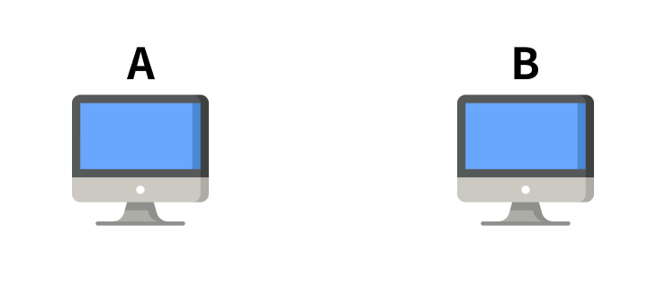
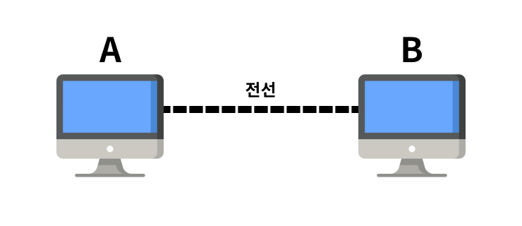
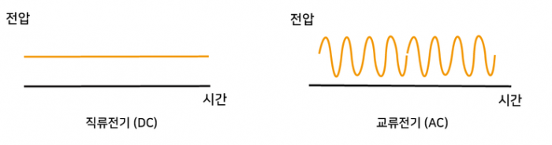

# 210708

## OSI 7 Layers

### OSI 모형이란?

> Open Systems Interconnection Reference Model

컴퓨터 네트워크 프로토콜[1](#footnotea1) 디자인과 통신을 계층으로 나누어 설명한 모델이다.
일반적으로 OSI 7계층(OSI 7 Layers)이라고 한다.

1. Physical Layer (물리 계층)
2. Data Link Layer (데이터 링크 계층)
3. Network Layer (네트워크 계층)
4. Transport Layer (전송 계층)
5. Session Layer (세션 계층)
6. Presentation Layer (표현 계층)
7. Application Layer (응용 계층)

### 계층 별 설명

#### 1. Physical layer

##### 배경

> 두 대의 컴퓨터 A와 B가 통신하려면 어떻게 해야 할까?

가장 먼저 데이터를 주고받으려면 두 컴퓨터는 연결되어 있어야 할 것이다. 전기가 흐르는 선으로 A와 B를 연결해보자.

**컴퓨터 내부에서는 모든 데이터를 이진법으로 다룬다.**
A에서 B로 데이터를 전달하고자 할 때, 전선을 통해 이진법으로 이루어진 데이터를 보내면 B 컴퓨터에서는 A에서 보낸 데이터를 쉽게 확인할 수 있다.

이진법은 0과 1로 이루어져 있으며, 컴퓨터 내부에서는 전기가 흐르는 상태를 1 / 흐르지 않는 상태를 0으로 생각하여 데이터 저장 및 연산 등의 작업을 한다.

**여기서 우리가 고민해봐야 하는 점은 전선이다.**
전선은 전기가 흐르는 선으로 우리가 일상생활에서 사용하고 전기는 **교류**이다.

### 

---

<b id="footnotea1">1<b> 컴퓨터끼리 "데이터 통신"을 원활하게 하기 위해 정해놓은 통신 규약(=약속, 규칙) [↩](#a1)

교류: 시간에 따라 전압이 달라지는 전기

---

참고

- [Physical Layer of internet model: Analog, Digital Data and Signal](https://www.indiastudychannel.com/resources/171556-Physical-Layer-of-internet-model-Analog-Digital-Data-and-Signal.aspx)

