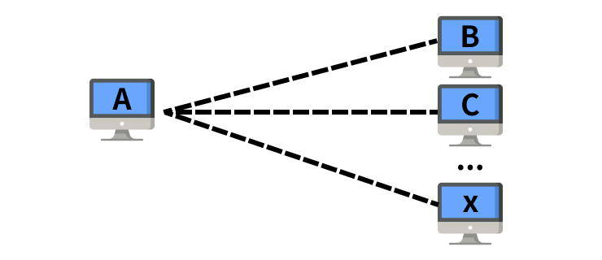
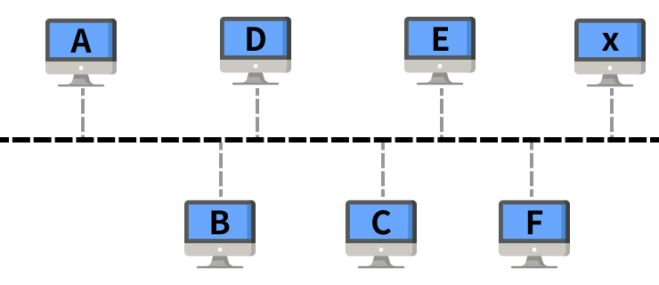

# OSI 7 Layers

## OSI 모형이란?

> Open Systems Interconnection Reference Model

컴퓨터 네트워크 프로토콜[1](#footnotea1) 디자인과 통신을 계층으로 나누어 설명한 모델이다.
일반적으로 OSI 7계층(OSI 7 Layers)이라고 한다.

1. Physical Layer (물리 계층)
2. Data Link Layer (데이터 링크 계층)
3. Network Layer (네트워크 계층)
4. Transport Layer (전송 계층)
5. Session Layer (세션 계층)
6. Presentation Layer (표현 계층)
7. Application Layer (응용 계층)

## 계층 별 설명

### 1. Physical layer

#### 배경

> 두 대의 컴퓨터 A와 B가 통신하려면 어떻게 해야 할까?

~

가장 먼저 데이터를 주고받으려면 두 컴퓨터는 연결되어 있어야 할 것이다. 전선으로 A와 B를 연결해보자.

A에서 B로 데이터를 전달하고자 할 때, 두 컴퓨터 간 연결된 전선을 통해 데이터를 보내면 B 컴퓨터에서는 A에서 보낸 데이터를 확인할 수 있을 것이다.

하지만, 컴퓨터 내부에서 데이터는 0과 1(이진값)로 이루어져있기 때문에 전선을 통해 데이터를 전달하기 위해서는 이진값을 신호(전자기 신호)로 변환해 주는 과정을 반드시 거쳐야한다.

또한, 전송 매체인 전선은 그저 터널일 뿐이기 때문에 physical layer는 데이터를 전송하기 위해 얼마나 많은 수의 논리 채널이 필요한지 결정해야 한다. 

#### 하는 일

1. 데이터를 보내기 전,
   1. 이진 값(0, 1)을 아날로그 신호로 변환 (encoding)
   2. 데이터를 전달하기 위해 필요한 논리 채널의 수 결정
2. 데이터를 받은 후,
   1. 아날로그 신호를 이진 값으로 변환 (decoding)

#### 사용 예시

> 하드웨어적으로 구현되어 있음

- 네트워크 어뎁터
- 리피터
- 네트워크 허브
- 모뎀

### 2. Data layer

#### 배경

> 여러 대의 컴퓨터가 통신하려면 어떻게 해야 할까?

A와 B는 서로 전선으로 연결되어 있고, 다른 컴퓨터는 연결되어있지 않기 때문에 데이터를 보낼 때 어디로 보낼 지 고민하지 않아도 된다.

- A에서 데이터를 보내면, 받는 곳은 당연히 B가 된다.

- B에서 데이터를 보내면, 받는 곳은 당연히 A가 된다.

만약 A에 C라는 컴퓨터를 더 연결하면 어떤 구조가 만들어질까?

통신할 컴퓨터의 수가 많지 않다면 이렇게 하나하나 연결할 수 있겠지만, 통신할 컴퓨터의 수가 100억대라면 연결할 수 있을까?

A에 100억개의 케이블을 연결할 수는 없을 것이다. 그렇다면 어떻게 해야할까?

쉽게 **도로를 생각해보자**. 각자의 집에서 스타벅스를 간다고 했을 때, 모든 집이 스타벅스로 갈 수 있는 직통 길이 있지는 않다. 각각의 집에서 시작하는 작은 도로가 있고, 그 작은 도로가 집결하는 큰 도로가 있다. 우리는 큰 도로를 거쳐 다른 작은 도로로 이동하여 스타벅스에 도착할 수 있게 될 것이다.
그렇다면, 컴퓨터도 이런 방식으로 연결하면 되지 않을까?

각각의 컴퓨터를 집이라고 가정해보자.

A 집에 살고 있는 병훈이는 C 집에 살고 있는 죠르디에게 "오늘 저녁에 밥먹으러 와"라는 말을 건네고 싶다. 그래서 "말 전달 로봇"에게 메세지를 담아 전선으로 흘려보냈다.
**어디로 가라는 내용이 없었기에** "말 전달 로봇"은 메인 전선과 연결된 모든 집에 "오늘 저녁에 밥먹으러 와"라는 말을 전달하였다. 이 얘기를 들은 모든 이웃은 그날 저녁 A의 집에 찾아갔고, A는 놀란 나머지 도망치고 말았다.

A 컴퓨터에 많은 전선을 꽂을 수 없었기 때문에 메인 전선과 각각의 컴퓨터가 연결된 방식을 이용하였지만, 데이터를 원하는 컴퓨터에 전달할 수 없는 문제가 발생했다.

만약, 메인 전선에 들어오는 모든 내용을 확인하는 장치가 있고, 그 장치가 표지판과 같은 역할을 한다면 원하는 컴퓨터에 데이터를 전달할 수 있지 않을까?

여러 컴퓨터가 연결되어 있는 "네트워크"에서 특정한 컴퓨터로 데이터를 전달하는 데 성공했다!

그런데... 위 네트워크에서 A와 B, C 모두 동시에 F에게 데이터를 보낸다면 F는 데이터를 제대로 읽어낼 수 있을까? 마치 우리가 **화상회의를 하면서 말이 겹치는 것 처럼**.

#### 주요 역할

1. Framing

   데이터를 프레임으로 쪼갠다.

   데이터를 프레임화하여, 얻을 수 있는 이점

   1. Reliablity

      전송 시 생기는 오류에 의해 전체 파일을 다시 받아야 하는 불상사를 방지할 수 있다.

   2. Easier Validation

      크기가 작아져 유효성 검증이 용이하다.

   3. Starvation

      아주 덩치가 큰 파일이 통신을 점유하고 있을 때, 다른 데이터는 무한 대기

2. Flow Control

   전송 속도와 수신 속도 차이를 보상

3. Error Control

   전송 시 발생하는 오류를 검출하고, 이를 수정한다.

4. Sequence Control

---

<b id="footnotea1">1<b> 컴퓨터끼리 "데이터 통신"을 원활하게 하기 위해 정해놓은 통신 규약(=약속, 규칙) [↩](#a1)

교류: 시간에 따라 전압이 달라지는 전기

---

참고

- [youtube - 10분 테코톡 히히의 OSI 7 Layer](https://youtu.be/1pfTxp25MA8)

- [Physical Layer of internet model: Analog, Digital Data and Signal](https://www.indiastudychannel.com/resources/171556-Physical-Layer-of-internet-model-Analog-Digital-Data-and-Signal.aspx)

- [위키백과 - OSI_모형](https://ko.wikipedia.org/wiki/OSI_%EB%AA%A8%ED%98%95)

