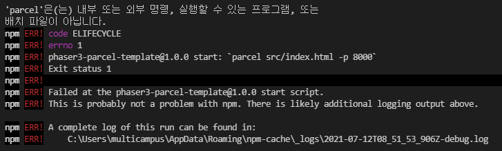

### Phaser3

### 참고

https://blog.ourcade.co/posts/2020/make-first-phaser-3-game-modern-javascript-part1/


- 오류

  - [x] parcel을 실행할 수 없음

    

    parcel을 전역설치

    ```bash
    $ yarn global add parcel-bundler
    ```

    그래도 안된다.

    **parcel 전역설치를 npm으로 해보자**

    ```bash
    $ npm install -g parcel-bundler
    ```

    성공!

  - [ ] 