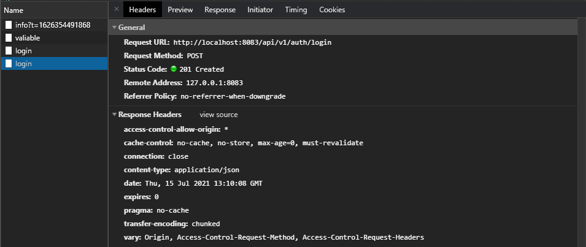
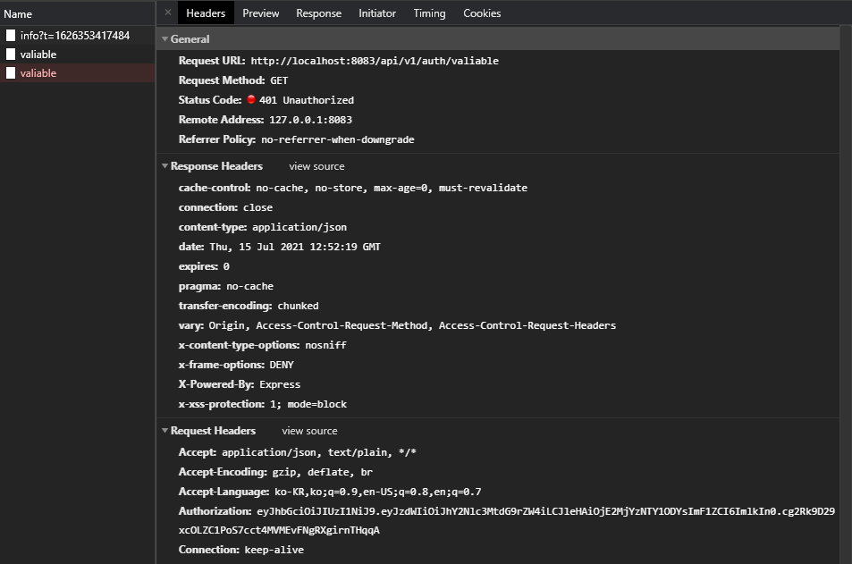
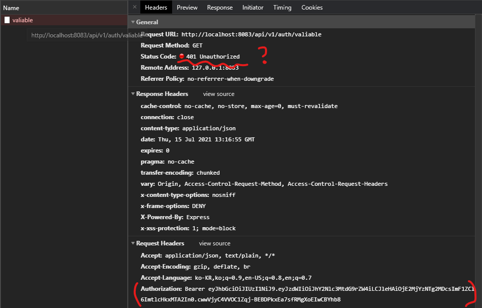
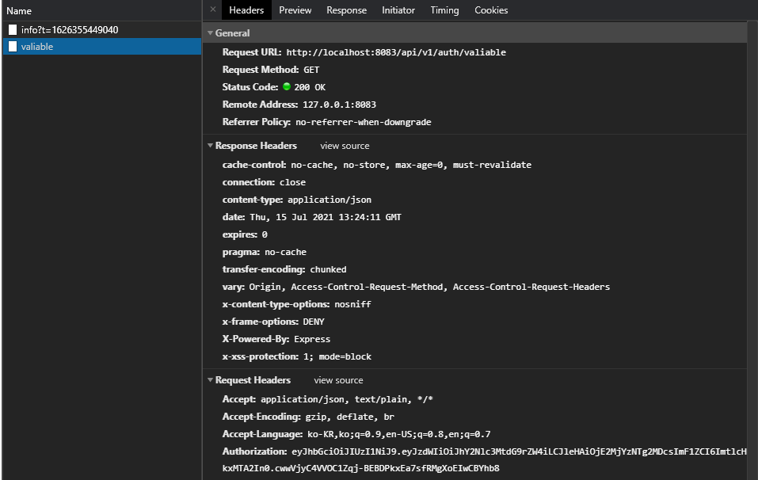

1. 로그인 시 JWT 받아오기

   로그인 시 Token을 받아와야 하는 데 받아오지 못하는 문제

   Token을 왜 받아오지 못할까 살펴봤다.

   

   > 로그인인데 201 status code도 어색한 것 같다.

   서버에서 응답은 정상적으로 하고 있었다. 그럼 어떤 내용물을 넘겨주는지 확인해보자.

   

   아하! 변수명이 일치되지 않아서 생기는 문제였다. 백엔드와 프론트엔드 간에 변수명 방식을 잘 맞춰놔야 하는 게 정말 중요하겠다는 생각이 들었다.

   

   

2. JWT 유효성 검증

   Front에서 토큰을 보내, 유효한 토큰인지 검사하는 과정을 진행하려고 했다. 하지만 반복해서 401에러가 발생했고, 어디에서 문제가 생기는지 확인해보았다.

   

   401에러라는 것은 경로 자체가 잘못된 것이 아니라는 것이었고, 나는 먼저 백엔드 코드를 살펴보았다. 토큰의 유효성을 검사하는 코드는 AuthController.java 에 있었고 다음과 같았다.

   

   ```java
   @GetMapping("/valiable")
       public ResponseEntity<Map<String, Object>> valiable(HttpServletRequest request) {
           Map<String, Object> resultMap = new HashMap<>();
           HttpStatus status = HttpStatus.OK;
   
           if (jwtService.isUsable(request.getHeader("access-token"))) {
               logger.info("사용 가능한 토큰!!!");
           } else {
           	status = HttpStatus.UNAUTHORIZED;
               logger.error("사용 불가능 토큰!!!");
           }
           return new ResponseEntity<Map<String, Object>>(resultMap, status);
       }
   ```

   코드를 살펴보다가 이상한 부분을 발견했다. 나는 Header에 `Authorization`이라는 이름으로 토큰 값을 넘겨주었지만, 백엔드에서는 `access-token`이라는 이름으로 찾고 있는 것이었다.

   자바 코드를 한 번도 본적이 없어서 내가 틀릴 수도 있었지만, 어림짐작으로 생각해보면 Header에서 Key를 이용해 Value를 가져오는 코드일 것이라는 생각이 들었고 다음과 같이 바꿔주었다.

   > 나중에 에러를 다시 구현하면서 콘솔을 확인해보았는데 출력되는 내용은 아래와 같았다.
   >
   > ```
   > 2021-07-15 21:52:19.642 ERROR 2308 --- [nio-8080-exec-1] c.ssafy.sub1.api.service.JwtServiceImpl  : JWT String argument cannot be null or empty.
   > 2021-07-15 21:52:19.643 ERROR 2308 --- [nio-8080-exec-1] c.ssafy.sub1.api.service.JwtServiceImpl  : 사용 불가능 토큰!!!
   > ```
   >
   > JWT String으로 들어가는 값이 비어있으면 안된다는 얘기

   

   ```java
   @GetMapping("/valiable")
   public ResponseEntity<Map<String, Object>> valiable(HttpServletRequest request) 	{
       Map<String, Object> resultMap = new HashMap<>();
       HttpStatus status = HttpStatus.OK;
   
       if (jwtService.isUsable(request.getHeader("accessToken"))) {
           logger.info("사용 가능한 토큰!!!");
       } else {
           status = HttpStatus.UNAUTHORIZED;
           logger.error("사용 불가능 토큰!!!");
       }
       return new ResponseEntity<Map<String, Object>>(resultMap, status);
   }
   ```

   > access-token  > Authorization

   

   토큰 유효성 검사 실시!

   

   > Token 정보는 제대로 넘어가는 데, Unauthorized라니...

   

   백엔드 콘솔을 살펴보았다.

   ```
   2021-07-15 22:16:55.561 ERROR 2308 --- [nio-8080-exec-3] c.ssafy.sub1.api.service.JwtServiceImpl  : Unable to read JSON value: �z��&�r#�$�3#Sb
   2021-07-15 22:16:55.561 ERROR 2308 --- [nio-8080-exec-3] c.ssafy.sub1.api.service.JwtServiceImpl  : 사용 불가능 토큰!!!
   ```

   > Unable to read JSON value???

   

   뭐가 문제인지 검색해보았고, [블로그](https://codeinlife.tistory.com/47)에서 답을 찾을 수 있었다.

   > 원인: 토큰에서 들어온 토큰값이 올바르지 않을 때 발생한다. Bearer JWT 토큰을 사용하고 있다면 Bearer을 지우고 실제 토큰값만 들어오게 해야 한다.

   

   Authorization 부분에서 토큰을 담을 때, Bearer 없이 토큰만 담았다.

   ```javascript
   export const requestCheckToken = async ({ state }) => {
     console.log("requestCheckToken", state)
     const url = "/auth/valiable"
     return axios.get(url, {
       headers: {
         Authorization: state.token,
         // Authorization: `Bearer ${state.token}`,
       },
     })
   }
   ```

   

   

   

   토큰이 유효한지 확인 성공!


