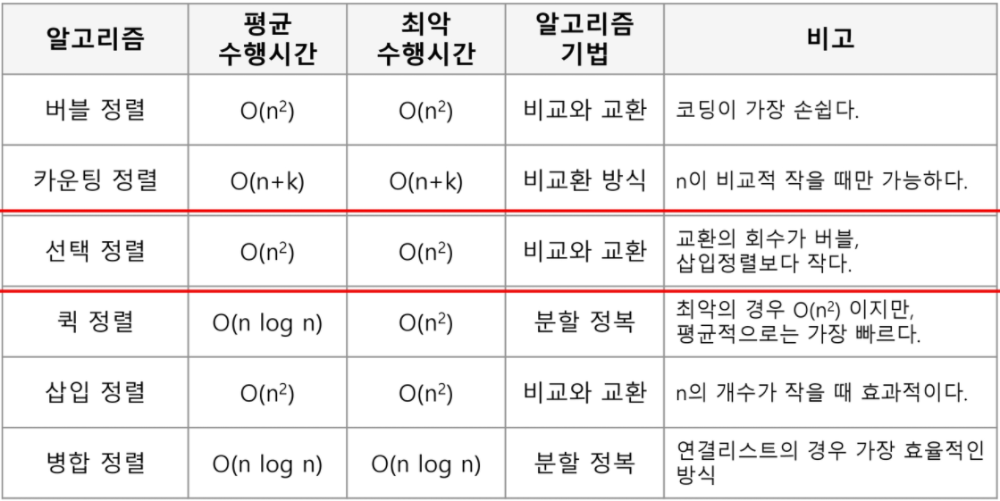

# 알고리즘 정리


## 진수


### 진수 변환

#### 나머지, 몫 활용

```python
def decimal_to_binary(decimal_num):
    binary_num = ""
    while decimal_num:
        binary_num = str(decimal_num % 2) + binary_num
        decimal_num //= 2
    return binary_num
```


#### 진수 변환 메서드 활용

```python
# 10진수 => 2진수
bin(decimal_num)

# 10진수 => 8진수
oct(decimal_num)

# 10진수 => 16진수
hex(decimal_num)
```


#### ⭐ format 활용

```python
def decimal_to_binary(decimal_num):
    return f"{decimal_num:b}"

def decimal_to_oct(decimal_num):
    return f"{decimal_num:o}"

def decimal_to_hex(decimal_num):
    return f"{decimal_num:x}"

# 변환 시 생성되는 이진수가 10자리로 통일되도록 하려면?
def decimal_to_binary(decimal_num):
    return f"{decimal_num:010b}"
```


## 정렬



### ⭐ Sort

#### 정렬 기준이 2개 이상일 때,

```python
numbers = [30, 1, 29, 4]
scores = [100, 90, 80, 80]

# 점수 내림차순
# 점수가 동일할 때 번호 오름차순
students = list(zip(numbers, scores))
students.sort(key=student: (-student[1], student[0]))
```


### 버블 정렬

```python
def bubble_sort(arr):
    # [55, 7, 78, 12, 42]
    for s in range(len(arr) - 1):
        for i in range(len(arr) - s - 1):
            n1 = arr[i]
            n2 = arr[i + 1]
            if n1 > n2:
                arr[i], arr[i + 1] = arr[i + 1], arr[i]
    return arr

print(bubble_sort([55, 7, 78, 12, 42]))
```


### 카운팅 정렬

```python
def counting_sort(arr):
    # [0, 4, 1, 3, 1, 2, 4, 1]
    count_arr = [0] * (max(arr) + 1)
    for num in arr:
        count_arr[num] += 1

    for i in range(1, len(count_arr)):
        count_arr[i] += count_arr[i - 1]

    answer = [0] * len(arr)
    for num in arr:
        idx = count_arr[num] - 1
        answer[idx] = num
        count_arr[num] -= 1
    return answer

print(counting_sort([0, 4, 1, 3, 1, 2, 4, 1]))
```


### 선택 정렬 O(kn)

```python
def selection_sort(arr):
    n = len(arr)
    for i in range(n - 1):
        min_idx = i
        for j in range(i + 1, n):
            if arr[j] < arr[min_idx]:
                min_idx = j
        arr[i], arr[min_idx] = arr[min_idx], arr[i]
    return arr

print(selection_sort([64, 25, 10, 22, 11]))
```


## 부분집합 - Combination

### 비트 연산자

```python
def sub_set(arr):
    n = len(arr)

    # 1 << n: 길이가 n인 배열이 가질 수 있는 모든 부분집합의 수
    for i in range(1 << n):
        sub_arr = []
        # 각 위치에 있는 값이 포함되어있는지 확인하기 위해
        # n + 1: 원소의 개수
        for j in range(n):
            # 부분집합의 패턴에 따라 값을 추가한다.
            # j번째 값이 포함되어 있어?
            if i & (1 << j):
                sub_arr.append(arr[j])
        print(sub_arr)

sub_set([3, 6, 7, 1, 5, 4])
```


### 라이브러리

> 첫 번째 인자: 부분집합을 구할 원본 배열
>
> 두 번째 인자: 부분집합의 길이

```python
from itertools import combination

def sub_set2(arr):
    n = len(arr)

    for i in range(n + 1):
        for sub_arr in combinations(arr, i):
            print(sub_arr)

sub_set2([3, 6, 7, 1, 5, 4])
```


### 조합 구하기

#### 반복문

```python
nums = [1, 2, 3, 4]
length = 2
combs = []

def get_combination(temp, s):
    if len(temp) == length:
        combs.append(temp)
        return
    for idx in range(s, len(nums)):
        # temp에 추가하고 다음으로 넘어가는 경우
        get_combination(temp + [nums[idx]], idx + 1)

get_combination([], 0)
```


#### ⭐combinations

```python
from itertools import combinations as cb

nums = [1, 2, 3, 4]
combs = list(cb(nums, 2))
# [(1, 2), (1, 3), (1, 4), (2, 3), (2, 4), (3, 4)]
```


## 검색 - Search


### 이진 검색 - Binary Search

#### 설명

자료의 가운데 있는 값을 찾으려는 값과 비교하여, 다음 검색 위치 (가운데 기준으로 아래 절반 혹은 위 절반)를 결정하고 검색을 진행하는 방법

시간복잡도: `O(logN)`

> 자료가 정렬된 상태여야 한다.

#### 코드

##### 재귀

```python
def binary_search(arr, target, r_idx, l_idx):
    mid = (r_idx + l_idx) // 2
    if arr[mid] == target:
        return mid
    elif target < arr[mid]:
        return binary_search(arr, target, r_idx, mid - 1)
    elif arr[mid] < target:
        return binary_search(arr, target, mid + 1, l_idx)

print(binary_search([2, 4, 7, 9, 11, 19, 23], 7, 0, 6))
```

##### 반복

```python
def binary_search(arr, target):
    s_idx = 0
    e_idx = len(arr) - 1
    while s_idx <= e_idx:
        mid = (s_idx + e_idx) // 2
        if arr[mid] == target:
            return mid
        elif target < arr[mid]:
            e_idx = mid - 1
        elif arr[mid] < target:
            s_idx = mid + 1
    else:
        return "찾을 수 없습니다"

print(binary_search([2, 4, 7, 9, 11, 19, 23], 21))
```


## DFS, BFS


### DFS

```python
dr = [-1, 0, 1, 0]
dc = [0, 1, 0, -1]

def dfs(arr, sr, sc):
    n = len(arr)
    visited = [[False] * n for _ in range(n)]
    stack = [[sr, sc]]
    visited[sr][sc] = True
    
    while stack:
        cr, cc = stack.pop()
        for di in range(4):
            nr = cr + dr[di]
            nc = cc + dc[di]
            if nr < 0 or n <= nr or nc < 0 or n <= nc:
                continue
            if visited[nr][nc]:
                continue
            stack.append([nr, nc])
            visited[nr][nc] = True
```


### BFS

```python
from collections import deque

dr = [-1, 0, 1, 0]
dc = [0, 1, 0, -1]

def bfs(arr, sr, sc):
    n = len(arr)
    
    visited = [[False] * n for _ in range(n)]
    queue = deque([(sr, sc)])
    while queue:
        cr, cc = queue.popleft()
        
        for di in range(4):
            nr = cr + dr[di]
            nc = cc + dc[di]
            if nr < 0 or nc < 0 or n <= nr or n <= nc:
                continue
            if visited[nr][nc]:
                continue
            
            queue.append((nr, nc))
            visited[nr][nc] = True
        
```


### Transpose

#### 인덱스 접근

```python
matrix = [[1, 2, 3], [4, 5, 6], [7, 8, 9]]

def transpose(m):
    N = len(m)
    m_t = []
    for c in range(N):
        t_row = []
        for r in range(N):
            t_row.append(m[r][c])
        m_t.append(t_row)
    return m_t

t_matrix = transpose(matrix)
```


#### ⭐ zip 메서드 사용

```python
matrix = [[1, 2, 3], [4, 5, 6], [7, 8, 9]]

t_matrix = list(map(list, zip(*matrix)))
```


### List 순환

#### ⭐enumerate

```python
names = ["죠르디", "라이언", "콘"]
ages = [3, 7, 7]

for idx, value in enumerate(zip(names, ages)):
    print(idx, value)
  	# 1 ("죠르디", 3)
    # 2 ("라이언", 7)
    # 3 ("콘", 7)
```


### 집합(Set)

```python
# 중복 제거
arr1 = [1, 1, 2, 2, 3, 4, 5, 6, 6, 6]
unique_arr1 = list(set(arr1))
# [1, 2, 3, 4, 5, 6]

# 두 집합에서 겹치는 요소 제거 (차집합)
arr2 = [1, 3, 5, 7, 9]
arr1_minus_arr2 = list(set(arr1) - set(arr2))
# [2, 4, 6]
```


### 소수 구하기

#### 반복문

1과 자신 외에 다른 수로 나누어떨어지는 수

반복하는 범위가 중요하다.

1. 모든 범위: `range(2, N)`
2. 제곱근까지의 범위: `range(2, int(N ** 0.5) + 1)`

```python
def check_prime_num(num):
    for n in range(2, int(num ** 0.5) + 1):
        if num % n == 0:
            return False
	return True
```


## 최대 공약수, 최소 공배수


### 최대 공약수

#### 구현

```python
def my_gcd(a, b):
    n1, n2 = max(a, b), min(a, b)
    while n2:
        print(n1, n2)
        n1, n2 = n2, n1 % n2
    return n1

print(my_gcd(12, 5))
```


#### 라이브러리

```python
from math import gcd
print(gcd(12, 5))
```


#### 셋 이상의 수일 때

```python
nums = [12, 6, 4, 2]
answer = 0
for i in range(1, len(nums)):
    if i == 1:
        answer = my_gcd(nums[i - 1], nums[i])
    else:
        answer = my_gcd(answer, nums[i])
    print(answer)
```


### 최소 공배수

> N1 * N2 = (N1과 N2의 최소 공배수) * (N1과 N2의 최대 공약수)

```python
from math import gcd

def lcm(x, y):
    return (x * y) // gcd(x, y)
```

