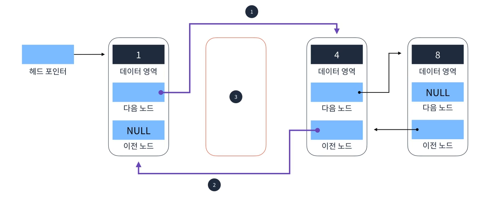
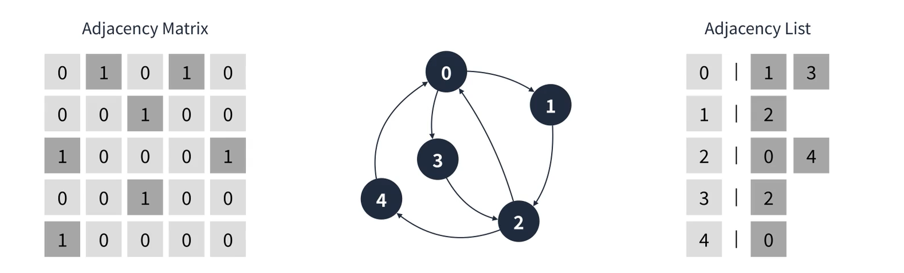

## 1. 자료구조

메모리를 효율적으로 사용하여 빠르고 안정적으로 데이터를 처리하기 위해, 상황에 따라 유용하게 사용될 수 있도록 특정 구조를 이루고 있다.

> 상황에 따라 유용 => 잘못 사용하는 경우에는 비효율적일 수 있다.

> 완벽한 자료구조는 없다.
>
> 더 좋고, 더 나쁜 자료구조는 없으며, 특정 상황에서 유용한 자료구조와 덜 유용한 자료구조로 나누어 질 뿐이다.

자료구조는 크게 3개의 구조로 나뉜다.

1. 단순 구조
   1. 정수
   2. 실수
   3. 문자열
   4. 논리
2. 선형 구조
   1. 배열
   2. 연결 리스트
   3. 스택
   4. 큐
3. 비선형 구조
   1. 트리
   2. 그래프


### 선형 구조

1차원 형태의 데이터 구조

한 원소 뒤에 하나의 원소만이 존재하는 형태. 자료들이 선형으로 나열되어 있는 구조를 가진다.

선형 구조에 해당되는 자료구조는 **배열, 연결 리스트, 스택, 큐** 등이 있다.

### 비선형 구조

원소 간 M:N 관계를 가지는 구조. 계층으로 구분되는 구조나 망 형태로 되어있는 구조를 표현하기에 적합하다.

비선형 구조에 해당되는 자료구조는 트리, 그래프 등이 있다.


## 2. 시간복잡도

프로그램의 성능을 제대로 알 수 있을까?

프로그램의 성능을 확인하기 위해 고려할 것들은 다양하다.
입력 크기, 하드웨어 성능, 운영체제 성능, 컴파일러 최적화, 비동기 로직 등

=> 프로그램의 성능을 정확히 파악하는 것은 불가능하다.
상대적인 성능 확인


### 빅 오 표기법


### 프로그램 성능 확인

#### Date 객체 이용

```javascript
const start = new Date().getTime()

// ...
const end = new Date().getTime()

console.log(end - start)
```


## 자바스크립트 코드 트릭

### 1. 구조 분해 할당 (destructuring assignment)

```javascript
let age1 = 30
let age2 = 40
[age1, age2] = [age2, age1]
console.log(age1, age2)	// 40 30
```


### 2. 배열 생성으로 루프 순회하기

```javascript
const sum = Array
	.from(new Array(4), (_, k) => k + 5)
	.reduce((arr, cur) => arr + cur, 0)
```

#### Array.from

유사 배열 객체를 배열로 바꾸는 데 사용

첫 번째 인자로는 유사 배열 객체, 두 번째 인자로는 배열 각 셀에 값을 넣을 수 있도록 콜백함수를 받는다.

> 두 번째 인자로 받는 콜백 함수에 전달되는 첫 번째 인자는 유사 배열 객체의 값이고, 두 번째 인자는 셀의 인덱스이다.

```javascript
Array.from("tei")	// ["t", "e", "i"]

Array.from([1, 2, 3], x => x * x)	// [1, 4, 9]

Array.from({length: 4})	// [undefined, undefined, undefined, undefined]

Array.from({length: 2}, () => Array(2).fill(0))	// [[0, 0], [0, 0]]
```


### 3. 배열 내 같은 요소 제거하기 (중복 제거)

```javascript
const names = ["김", "이", "박", "최", "노", "김", "김"]
const uniqueNamesWithArrayFrom = Array.from(new Set(names))	// ["김", "이", "박", "최", "노"]
const uniqueNamesWithSpread = [...new Set(names)]			// ["김", "이", "박", "최", "노"]
```

#### Set

중복을 허용하지 않는 값을 모아놓은 컬렉션

- `new Set(iterable)`


### 4. 객체 병합하기

```javascript
const obj1 = {
    name: "kim",
    age: 30,
    city: "gunpo",
}

const obj2 = {
    age: 31,
    city: "sokcho",
}

console.log({...obj1, ...obj2})	// {name: "kim", age: 31, city: "sokcho"}
console.log({...obj2, ...obj1})	// {name: "kim", age: 30, city: "gunpo"}
```


### 5. ||와 && 활용

```javascript
// ||
// 기본값을 할당할 때 사용
const name = nullableValue || "Unknown"

// &&
// 조건부 실행 혹은 할당
booleanValue && func()

const getCompany = (showAddress) => ({
    name: "혼냅",
    ...showAddress && {address: "Seoul"},
})
console.log(getCompany(false))	// {name: "혼냅"}
console.log(getCompany(true))	// {name: "혼냅", address: "Seoul"}
```


### 6. 구조 분해 할당 사용 

```javascript
const person = {
    name: "kim",
    age: 30,
    city: "sokcho",
}

const {age, city} = person
```


### 7. 비구조화 할당 사용, 객체 생성시 키 생략

```javascript
const makeCompany = ({name, address, serviceName}) => ({
    name,
    address,
    serviceName,
})

const matchere = makeCompany({ name: "매치히어", address: "온라인", serviceName: "매치히어" })
```


### 8. 동적 속성 이름

```javascript
const TAB_TYPE = {
    KEYWORD: "KEYWORD",
    HISTORY: "HISTORY",
}

const TAB_LABEL = {
    [TAB_TYPE.KEYWORD]: "추천 검색어",
    [TAB_TYPE.HISTORY]: "최근 검색어",
}
```


### 9. !! 연산자를 이용하여 Boolean 값으로 변경하기

```javascript
function check (variable) {
    if (!!variable) {
        console.lor(variable, "truthy")
    } else {
        console.log(variable, "falsy")
    }
}

check(0)			// 0, "falsy"
check(null)			// null, "falsy"
check(undefined)	// undefined, "falsy"
check(false)		// false, "falsy"
check("")			// <empty string>, "falsy"
check(NaN)			// NaN, "falsy"
```


# 3. 배열과 객체

## 배열

### 배열의 특징

- 고정된 크기를 가지며, 일반적으로는 동적으로 크기를 늘릴 수 없다.

  > 자바스크립트는 동적으로 크기가 증감되도록 만들어져 있다.

- 원하는 원소의 index를 알고 있다면 `O(1)`의 시간 복잡도로 원소를 찾을 수 있다.
- 원소를 삭제하면 해당 index에 빈자리가 생긴다.

### 자바스크립트에서 배열의 특징

- 자바스크립트의 배열은 동적으로 크기가 증감되도록 만들어져 있다.

- 자바스크립트의 배열은 HashMap에 가깝다.

  > index가 number 타입이 아니어도 된다.


### 배열 요소 삭제

배열의 요소를 삭제하는 경우 최대 `O(n)` 시간 복잡도가 소요된다.

### 배열 요소 추가

배열의 요소를 추가하는 경우 최대 `O(n)` 시간 복잡도가 소요된다.


**=> 추가와 삭제가 반복되는 로직이라면, 배열 자료구조는 권장하지 않는다.**

---

### JS에서 사용법

#### 배열 생성

1. 배열 리터럴을 통해 생성하기
2. 배열 생성자를 통해 생성하기

```javascript
// 1.
// 빈 array를 생성 (리터럴)
let arr1 = []

// 2.
// 초기화된 array를 생성
let arr2 = [1, 2, 4, 8]

// 3.
// Array 생성자 활용
let arr3 = Array(4).fill(0)
// [0, 0, 0, 0]

// 4.
// 유사 배열 객체와 Array.from 메서드를 활용
let arr4 = Array.from({length: 100}, (_, i) => i)
// [0, 1, 2, ...]
```


#### 배열 요소 추가, 삭제

> splice 메서드는 최대 O(n) [선형 시간]이 소요된다.

```js
let arr = [1, 2, 3]

arr.push(4)	// O(1)
arr.push(5, 6)	// O(1)
arr.splice(3, 0, 128)	// O(n)
// [1, 2, 3, 128, 4, 5, 6]

arr.pop()	// O(1)
arr.splice(3, 1)	// O(n)
// [1, 2, 3, 4, 5, 6]
```


#### 배열의 프로퍼티, 메서드

```js
const arr = [1, 2, 3, 4, 5]

// Array.length: 배열의 길이
console.log(arr.length)	// 5

// Array.join(glue): 배열 요소를 하나의 문자열로 합친다.
console.log(arr.join("||"))	// 1||2||3||4||5

// Array.reverse(): 원본 배열의 순서를 뒤집는다.
console.log(arr.reverse())	// [5, 4, 3, 2, 1]
console.log(arr)			// [5, 4, 3, 2, 1]

// Array.prototype.concat(arr1[, arr2]): 배열을 합친다.
console.log(arr.concat([0]))	// [5, 4, 3, 2, 1, 0]

// Array.prototype.push(): 배열 끝에 요소를 추가
arr.push(-1)
console.log(arr)	// [5, 4, 3, 2, 1, 0, -1]

// Array.prototype.pop(): 배열 끝에 요소를 삭제
console.log(arr.pop())	// -1
console.log(arr)		// [5, 4, 3, 2, 1, 0]

// Array.prototype.shift(): 배열 맨 앞 요소를 삭제
arr.shift()
console.log(arr)		// [4, 3, 2, 1, 0]

// Array.prototype.unshift(): 배열 맨 앞 요소 추가
arr.unshift(5)
console.log(arr)		// [5, 4, 3, 2, 1, 0]

const arr1 = [1, 2, 3, 4]
// Array.prototype.slice(startIdx, endIdx): 배열의 일부를 복사 (startIdx부터 endIdx 전까지)
console.log(arr1.slice(1, 3))	// [2, 3]

// Array.prototype.splice(startIdx[, deleteCount[, item1]]): 배열 일부를 삭제, 추가, 교체하는 데 사용한다.
arr1.splice(4, 0, 5, 6)
console.log(arr1)	// [1, 2, 3, 4, 5, 6]

arr1.splice(4, 2)
console.log(arr1)	// [1, 2, 3, 4]

arr1.splice(2, 1, 333)	// [1, 2, 333, 4]
```

```js
// 배열 순회
const arr = [1, 2, 3, 4]

for (let i of arr) {
    console.log(arr)
}
```


## 객체

### JS에서 사용법

#### 객체 생성

1. 객체 리터럴을 통한 생성
2. 객체 생성자를 통한 생성

```js
const obj1 = {}
const obj2 = {key: "value"}
const obj3 = new Object()
const obj4 = new Object({key: "value"})

console.log(obj1)	// {}
console.log(obj2)	// {key: 'value'}
console.log(obj3)	// {}
console.log(obj4)	// {key: 'value'}
```

#### 객체 요소 삭제

```js
const obj1 = {key: "value", name: "김병훈"}

delete obj1.key
console.log(obj1)	// {name: '김병훈'}
```


#### 객체에 특정한 key가 있는지 확인하기

```js
const obj = {name: "김병훈", city: "군포"}

console.log("city" in obj)		// true
console.log("company" in obj)	// false
```


#### 객체 순회

```js
const obj = {name: "김병훈", city: "군포"}

for (const key in obj) {
    console.log(key, obj[key])
}
```


# 4. 연결 리스트

> 배열은 중간에 요소를 삽입하거나 삭제하는 경우 최대 O(n) 시간 복잡도를 갖는다. 이로 인해 추가와 삭제가 반복되는 로직을 구현하는 데에는 적합하지 않는다.

> 추가와 삭제가 반복되는 로직에 적합한 자료구조는 연결 리스트이다.

연결 리스트는 각 요소를 포인터로 연결하여 관리하는 선형 자료구조이다.
각 요소는 노드라고 부르며 데이터 영역과 포인터 영역으로 구성된다.

### 연결 리스트의 특징

- 동적으로 요소를 추가할 수 있다. (메모리가 허용하는 한)

- 탐색은 O(n)이 소요된다.

  > 탐색은 배열 혹은 객체가 적합하다.

- 요소를 추가하거나 삭제하는 데에는 O(1)이 소요된다.

- Singly Linked List (단일), Doubly Linked List(이중), Circular Linked List(선형)가 존재한다.


### 단일 연결 리스트

Head에서 Tail까지 단방향으로 이어지는 연결 리스트


헤드 포인터가 가리키고 있는 노드: Head

포인터 영역이 Null인 노드: Tail


#### 요소 찾기 O(n)

값이 4인 노드를 찾기

1. 헤드 포인터가 가리키는 노드 확인
   1. 데이터가 4인가?
2. 다음 노드 확인
   1. 데이터가 4인가?
3. 반복


#### 요소 추가

> 추가를 하는 데에는 상수시간이 걸리지만, 추가를 위해 2 또는 4를 탐색해야 한다면 탐색하는 데에는 O(n) 만큼의 시간이 소요된다.
>
> 따라서, 요소를 추가할 때에는 탐색을 하지 않도록 로직을 설계해야 한다.


### 이중 연결 리스트

양방향으로 이어지는 연결 리스트

Singly Linked List에 비해 메모리 사용량이 크다.


#### 요소 추가

1. 추가할 노스(3)의 다음 노드 포인터가 추가할 위치 다음 노드(4)를 가리키도록 설정한다.
2. 추가할 위치 이전 노드(2)의 다음 노드 포인터가 추가할 노드(3)를 가리키도록 설정한다.
3. 추가할 위치 다음 노드(4)의 이전 노드 포인터가 추가할 노드(3)을 가리키도록 설정한다.
4. 추가할 노드(3)의 이전 노드 포인터가 추가할 위치 이전 노드(2)를 가리키도록 설정한다.


#### 요소 삭제

1. 삭제할 노드의 이전 노드(1)의 다음 노드 포인터가 삭제할 노드의 다음 노드(4)를 가리키도록 설정한다.
2. 삭제할 노드의 다음 노드(4)의 이전 노드 포인터가 삭제할 노드의 이전 노드(1)을 가리키도록 설정한다.
3. 삭제할 노드(2)를 삭제한다.



### 환형 연결 리스트

Tail이 Head로 연결되는 연결 리스트


### JS에서 사용법

```js
class Node {
  constructor(value) {
    this.value = value
    this.next = null
  }
}

class SinglyLinkedList {
  constructor() {
    this.head = null
    this.tail = null
  }

  find(value) {
    let cNode = this.head
    while (cNode.value !== value) {
      cNode = cNode.next
    }
    return cNode
  }

  append(value) {
    const newNode = new Node(value)
    if (this.head === null) {
      this.head = newNode
      this.tail = newNode
    } else {
      this.tail.next = newNode
      this.tail = newNode
    }
  }

  // node 다음에 추가하는 경우
  insert(node, newValue) {
    const newNode = new Node(newValue)
    newNode.next = node.next
    node.next = newNode
  }

  remove(value) {
    let pNode = this.head

    while (pNode.next.value !== value) {
      pNode = pNode.next
    }

    if (pNode.next !== null) {
      pNode.next = pNode.next.next
    }
  }

  display() {
    let cNode = this.head
    let valueList = []
    while (cNode !== null) {
      valueList.push(cNode.value)
      cNode = cNode.next
    }
    console.log(valueList.join(", "))
  }
}

const linkedList = new SinglyLinkedList()
linkedList.append(1)
linkedList.append(2)
linkedList.append(3)
linkedList.append(4)
linkedList.append(5)
linkedList.display()
console.log(linkedList.find(4))
linkedList.remove(3)
linkedList.display()
```


# 5. 스택

Last in First Out 개념을 가진 선형 자료구조


### 예시

스택 메모리

> 실행되는 함수, 매개변수 등이 저장되는 메모리 영역


### 표현

#### Array로 표현하기

```js
const arr = []
arr.push(1)
arr.pop()
```


#### Linked List로 표현하기

```js
class Node {
    constructor(value) {
        this.value = value
        this.next = null
    }
}

class Stack {
    constructor() {
        this.top = null
        this.size = 0
    }
    
    push(value) {
        const newNode = new Node(value)
        node.next = this.top
        this.top = node
        this.size += 1
    }
    
    pop() {
        const value = this.top.value
        this.top = this.top.next
        this.size -= 1
        return value
    }
    size() {
        return this.size
    }
}
```


```js
class Node{
    constructor(value) {
        this.value = value
        this.next = null
        this.before = null
    }
}

class DoublyLinkedList {
    constructor() {
        this.head = null
        this.tail = null
    }
    
    push(value) {
        const newNode = new Node(value)
        if (this.head === null) {
            this.head = newNode
            this.tail = newNode
        } else {
            newNode.before = this.tail
            this.tail.next = newNode
            this.tail = newNode
        }
    }
    
    pop() {
        if (this.head === null) {
            return
        } else if (this.head === this.tail) {
            this.head = null
            this.tail = null
        } else {
            const pNode = this.tail.before
            pNode.next = null
        }
    }
    
    display() {
        let cNode = this.head
        let valueList = []
        while (cNode !== null) {
          valueList.push(cNode.value)
          cNode = cNode.next
        }
        console.log(`[${valueList.join(", ")}]`)
    }
}

const linkedList = new DoublyLinkedList()

linkedList.push(1)
linkedList.display()
linkedList.pop()
linkedList.display()
linkedList.push(1)
linkedList.push(11)
linkedList.push(12)
linkedList.push(13)
linkedList.display()
```


# 6. 큐


## 큐

First In First Out 개념을 가진 선형 자료구조


### 선형 큐

#### 1. Array로 표현하기

```js
class Queue {
    constructor() {
        this.queue = []
        this.front = 0
        this.rear = 0
    }
    
    enQueue(value) {
        this.queue[this.rear++] = value
    }
    
    deQueue() {
        const value = this.queue[this.front]
        delete this.queue[this.front]
        this.front += 1
        return value
    }
    
    peak() {
        return this.queue[this.front]
    }
    
    size() {
        return this.rear - this.front
    }
}
```


#### 2. LinkedList로 표현하기


```js
class Node {
    constructor(value) {
        this.value = value
        this.next = null
    }
}

class Queue {
    constructor() {
        this.head = null
        this.tail = null
        this.size = 0
    }
    
    enQueue(value) {
        const newNode = new Node(value)
        if (this.size === 0) {
            this.head = newNode
            this.tail = newNode
        } else {
            this.tail.next = newNode
            this.tail = newNode
        }
        this.size += 1
    }
    
    deQueue() {
        if (this.size === 0) {
            return null
        }
        const value = this.head
        this.head = this.head.next
        this.size -= 1
        return value
    }
    
    front() {
        return this.head.value
    }
    
    rear() {
        return this.tail.value
    }
}
```


### 환형 큐

#### 1. Array로 표현하기

```js
class Queue {
    constructor(maxSize) {
        this.maxSize = maxSize
        this.queue = []
        this.front = 0
        this.rear = 0
        this.size = 0
    }
    
    enQueue(value) {
        if (this.isFull()) {
            console.log("Queue is full")
            return
        }
        this.queue[this.rear] = value
        this.size += 1
        this.rear = (this.rear + 1) % this.maxSize
    }
    
    deQueue() {
        const value = this.queue[this.front]
        delete this.queue[this.front]
        this.front = (this.front + 1) % this.maxSize
        this.size -= 1
        return value
    }
    
    isFull() {
        return this.size === this.maxSize
    }
    
    peek() {
        return this.queue[this.front]
    }
}
```


### 문제 풀이

#### 프린터

LinkedList를 활용하여 Queue를 구현해보자

```js
class Node {
    constructor(value) {
        this.value = value
        this.next = null
    }
}

class Queue {
    constructor() {
        this.head = null
        this.tail = null
        this.size = 0
    }
    
    enqueue(value) {
        const newNode = new Node(value)
        if (this.head === null) {
            this.head = newNode
            this.tail = newNode
        } else {
            this.tail.next = newNode
            this.tail = newNode
        }
        this.size += 1
    }
    
    dequeue() {
        const value = this.head.value
        this.head = this.head.next
        this.size -= 1
        return value
    }
}

function solution(priorities, location) {
    const queue = new Queue()
    priorities.forEach((p, i) => {
        queue.enqueue([p, i])
    })
    
    priorities.sort((a, b) => b - a)
    
    let count = 0
    while (queue.size) {
        const [p, i] = queue.dequeue()
        if (p < priorities[count]) {
            queue.enqueue([p, i])
        } else {
            count += 1
            if (i === location) {
                return count
            }
        }
    }
}
```


```js
class Node {
  constructor(value) {
    this.value = value
    this.next = null
  }
}

class Queue {
  constructor() {
    this.head = null
    this.tail = null
    this.size = 0
  }

  enqueue(value) {
    const newNode = new Node(value)
    if (this.head === null) {
      this.head = this.tail = newNode
    } else {
      this.tail.next = newNode
      this.tail = newNode
    }
    this.size += 1
  }

  dequeue() {
    const value = this.head.value
    this.head = this.head.next
    this.size -= 1
    return value
  }
}

function solution(priorities, location) {
  const queue = new Queue()
  const prioritiesQueue = new Queue()
  priorities.forEach((priority, i) => {
    queue.enqueue([priority, i === location])
  })
  priorities
    .sort((a, b) => b - a)
    .forEach((priority) => {
      prioritiesQueue.enqueue(priority)
    })

  let count = 1
  while (queue.size) {
    const [priority, isMine] = queue.dequeue()
    if (priority === prioritiesQueue.head.value) {
      prioritiesQueue.dequeue()
      if (isMine) {
        return count
      }
      count += 1
    } else {
      queue.enqueue([priority, isMine])
    }
  }
}
```


#### 기능개발

```js
class Node {
  constructor(value) {
    this.value = value
    this.next = null
  }
}

class Queue {
  constructor() {
    this.head = null
    this.tail = null
    this.size = 0
  }

  enqueue(value) {
    const newNode = new Node(value)
    if (this.head === null) {
      this.head = this.tail = newNode
    } else {
      this.tail.next = newNode
      this.tail = newNode
    }
    this.size += 1
  }

  dequeue() {
    const value = this.head.value
    this.head = this.head.next
    this.size -= 1
    return value
  }
}

function solution(progresses, speeds) {
  const answer = []
  const queue = new Queue()
  progresses.forEach((progress, i) => {
    queue.enqueue([progress, speeds[i]])
  })

  while (queue.size) {
    let cNode = queue.head
    while (cNode) {
      const [p, s] = cNode.value
      cNode.value = [p + s, s]
      cNode = cNode.next
    }
    cNode = queue.head
    let count = 0
    while (cNode && cNode.value[0] >= 100) {
      queue.dequeue()
      count += 1
      cNode = queue.head
    }
    if (count > 0) {
      answer.push(count)
    }
  }
  console.log(answer)
  return answer
}
```


# 7. 해시 테이블


## 해시 테이블

키와 값을 받아 해싱(Hashing)하여 나온 index에 값을 저장하는 선형 자료구조


> 입력, 삭제, 탐색 시 O(1)이 소요된다.
>
> 해시 함수는 키를 입력받아 특정한 index를 반환하는 함수를 말한다.

### 해시 충돌

> 서로 다른 키 값을 갖지만, 해시 함수 결과가 같게 되는 경우를 "해시 충돌"이라고 한다.

#### 해결 방법

##### 선형 탐사법

충돌이 발생하면 옆으로 한 칸 이동한다.


##### 제곱 탐사법


##### 이중 해싱


##### 분리 연결법


### 사용 예시

학생 정보를 관리하는 프로그램을 만들 때,

- 연결리스트를 사용하면, 학생 정보를 **탐색할 때 O(n)** 시간 복잡도가 소요된다.
- 배열을 사용하면, index를 모를 경우 **탐색할 때 O(n)** 시간 복잡도가 소요된다.
- 해시 테이블을 사용하면 **탐색 시 O(1)** 시간 복잡도가 소요된다.


### JS로 표현하기

#### JavaScript Object

```js
const table = {}
table["key"] = 100
table["key2"] = "hello"
console.log(table["key2"])	// "hello"
delete table["key2"]
console.log(table["key2"])	// undefined
```

#### Map

https://ko.javascript.info/map-set

- 편리한 메서드가 세팅되어있다.
- object와 같이 복잡한 구조의 값을 key로 사용할 수 있다.

```js
const table = new Map()

// Map.prototype.set(key, value)
table.set("key", 100)
table.set("key2", "hello")

// Map.prototype.get(key)
console.log(table["key"])	// undefined
table.get("key")			// 100

// Map.prototype.values(), Map.prototype.keys(), Map.prototype.entries()
console.log(table.values())
console.log(Array.from(table.values()))
console.log(table.keys())
console.log(Array.from(table.keys()))
console.log(table.entries())
console.log(Array.from(table.entries()))

// Map.prototype.delete(key)
table.delete("key2")
console.log(table.get("key2"))	// undefined

// Map.prototype.clear()
table.clear()
```

#### Set

- 중복을 허용하지 않는다.

```js
let set = new Set();

let john = { name: "John" };
let pete = { name: "Pete" };
let mary = { name: "Mary" };

// 어떤 고객(john, mary)은 여러 번 방문할 수 있습니다.
set.add(john);
set.add(pete);
set.add(mary);
set.add(john);
set.add(mary);

// 셋에는 유일무이한 값만 저장됩니다.
alert( set.size ); // 3

for (let user of set) {
  alert(user.name); // // John, Pete, Mary 순으로 출력됩니다.
}
```


### 문제

#### 배열에서 중복 요소 제거하기

arr에서 중복 값을 제거해 주는 함수 unique(arr)를 만들어보세요.

```js
function unique(arr) {
  /* 제출 답안 */
}

let values = ["Hare", "Krishna", "Hare", "Krishna",
  "Krishna", "Krishna", "Hare", "Hare", ":-O"
];

alert( unique(values) ); // 얼럿창엔 `Hare, Krishna, :-O`만 출력되어야 합니다.
```

```js
function unique(arr) {
    return Array.from(new Set(arr))
}
```


#### 애너그램 걸러내기

애너그램으로 만든 단어를 걸러내는 함수 `aclean(arr)`을 만들어보세요.

```js
let arr = ["nap", "teachers", "cheaters", "PAN", "ear", "era", "hectares"];

alert( aclean(arr) ); // "nap,teachers,ear"나 "PAN,cheaters,era"이 출력되어야 합니다.
```

```js
function aclean(arr) {
    const _map = new Map()
    
    arr.forEach((word) => {
        const key = word.toLowerCase().split("").sort().join("")
        _map.set(key, word)
    })
    return Array.from(_map.values())
}
```


#### 반복 가능한 객체의 키

`map.keys()`를 사용해 배열을 반환받고, 이 배열을 변수에 저장해 `.push`와 같은 배열 메서드를 적용하고 싶다고 해봅시다.

작동하지 않네요.

```js
let map = new Map();

map.set("name", "John");

let keys = map.keys();

// Error: keys.push is not a function
keys.push("more");
```

```js
let map = new Map();

map.set("name", "John");

let keys = Array.from(map.keys());

keys.push("more");
```


#### 베스트앨범

요구사항

1. 같은 장르끼리 묶는다.
2. 묶인 노래들을 재생 순으로 정렬한다.
3. 노래를 2개까지 자른다.

```js
function solution(genres, plays) {
    var answer = [];
    const obj = {}
    for (let i = 0; i < genres.length; i++) {
        if (genres[i] in obj) {
            obj[genres[i]].totalPlays += plays[i]
            obj[genres[i]].songs.push([plays[i], i])
        } else {
            obj[genres[i]] = {
                totalPlays: plays[i],
                songs: [[plays[i], i]],
            }
        }
    }
    const sorted_genres = Object.entries(obj).sort((a, b) => b[1].totalPlays - a[1].totalPlays)
    // console.log(sorted_genres)
    sorted_genres.forEach(([genre, o]) => {
        o.songs.sort((a, b) => b[0] - a[0])
        for (let i = 0; i < Math.min(2, o.songs.length); i++) {
            answer.push(o.songs[i][1])
        }
    })
    // console.log(answer)
    return answer;
}
```

```js
function solution(genres, plays) {
    const genreMap = new Map()
    genres
    	.map((genre, index) => [genre, plays[index]])
    	.forEach(([genre, play], index) => {
        	const data = genreMap.get(genre) || {
                totalPlay: 0,
                songs: [],
            }
	        genreMap.set(genre, {
                totalPlay: play + data.totalPlay,
                songs: [...data.songs, [play, index]]
            })
    	})
    // console.log(
    // [...genreMap.entries()]
    //     .sort((a, b) => b[1].totalPlay - a[1].totalPlay)
    //     .flatMap((item) => item[1].songs.sort((a, b) => b[0] - a[0]).slice(0, 2))
    //     .map((item) => item[1])
    // )
    return [...genreMap.entries()]
        .sort((a, b) => b[1].totalPlay - a[1].totalPlay)
        .flatMap((item) => item[1].songs.sort((a, b) => b[0] - a[0]).slice(0, 2))
        .map((item) => item[1])
}
```


#### 완주하지 못한 선수

```js
function solution(participant, completion) {
    var answer = '';
     const p_obj = {}
     participant
        .forEach((name) => {
         p_obj[name] = { count: p_obj[name] ? p_obj[name].count + 1 : 1 }
     })
    completion
        .forEach((name) => {
        const data = p_obj[name]
        if (data.count === 1) {
            delete p_obj[name]
        } else {
            p_obj[name] = { count: p_obj[name].count - 1 }   
        }
    })
    console.log(p_obj)
    return Object.keys(p_obj)[0];
}
```


# 8. 그래프

정점과 정점 사이를 연결하는 간선으로 이루어진 비선형 자료구조

정점 집합(Node)와 간선 집합(Edge)으로 표현할 수 있다.

> 지금까지는 선형 자료구조였지
> 배열, 스택, 큐, 연결 리스트


## 특징

- 정점은 여러 개의 간선을 가질 수 있다.

  > 선형 자료구조는 하나의 노드의 앞뒤로 노드가 하나씩 연결되지만, 비선형 자료구조인 그래프는 하나의 노드에 여러 노드가 연결될 수 있다.

- 크게 방향 그래프와 무방향 그래프로 나눌 수 있다.

- 간선은 가중치를 가질 수 있다.

  > A - (2) -> B -(3) -> C

- 사이클이 발생할 수 있다.

  > A -> B -> C -> A


## 간선의 방향에 따른 분류

### 무방향 그래프

간선에 방향이 존재하지 않는다. (양방향으로 이동이 가능하다.)

### 방향 그래프

간선에 방향성이 존재한다.


## 노드 연결 상태에 따른 분류

### 연결 그래프

모든 노드가 연결되어 있는 그래프

한 노드에서 모든 노드로 이동할 수 있다.

### 비연결 그래프

특정한 노드는 연결되어 있지 않은 그래프

### 완전 그래프

모든 정점끼리 서로 연결되어 있는 그래프


## 구현 방법

인접 행렬, 인접 리스트



### 인접 행렬

2차원 행렬이기에 많은 메모리를 차지한다.

A노드와 B노드가 연결되어 있는지 확인하는 탐색은 빠르다.

```js
const graph = Array.from(Array(5), () => Array(5).fill(false))	// 5X5 2차원 배열 생성

graph[0][1] = true
graph[0][3] = true
graph[1][2] = true
graph[2][0] = true
graph[2][4] = true
graph[3][2] = true
graph[4][0] = true

console.log(graph)
```

```js
// 간선에 가중치가 있는 경우
const graph = Array.from(Array(5), () => Array(5).fill(null))

graph[0][1] = 2
graph[0][3] = 1
graph[1][2] = 1
graph[2][0] = 3
graph[2][4] = 2
graph[3][2] = 2
graph[4][0] = 1
```


### 인접 리스트

연결되어 있는 정보만 저장하기에 메모리를 적게 차지한다.

노드간 연결 정보를 확인하는 과정이 다소 느리다.

```js
const graph = Array.from(Array(5), () => [])
// [[], [], [], [], []]

graph[0].push(1)
graph[0].push(3)
// ...
```


# 9. 트리

방향 그래프의 일종으로 정점을 가리키는 간선이 하나 밖에 없는 구조를 가지고 있다.


디렉토리 구조, 조직도 등에서 활용

## 특징

- 루트 정점을 제외한 모든 정점은 반드시 하나의 부모 정점을 가진다.
- 정점이 N개인 트리는 N - 1개의 간선을 가진다. (루트 노드)
- 루트에서 특정 정점으로 가는 경로는 유일하다.


## 이진트리

이진 트리는 각 정점이 최대 2개의 자식 정점(0 ~ 2)을 갖는 트리를 의미한다.


### 특징

- 정점이 N개인 이진 트리가 가질 수 있는 최대 높이는 N이다. (편향 트리)
- 정점이 N개인 포화 또는 완전 이진 트리의 높이는 logN이다. (1, 2, 4, 8, ...)
- 높이가 h인 포화 이진 트리는 2^h - 1개의 정점을 가진다. (1 = 2 - 1 / 3 = 4 - 1 / 7 = 8 - 1)
- 일반적인 이진 트리를 사용하는 경우는 많지 않고, 다음 응용 구조에 사용된다.
  - 이진 탐색 트리
  - 힙
  - AVL 트리
  - 레드 블랙 트리

### 구현

트리는 그래프의 일종이기에 그래프 구현 방식과 동일하게 (인접 행렬, 인접 리스트) 구현 가능

#### 이진 트리(Array)


```js
// 0번 인덱스는 편의를 위해 비워둔다.
// left = index * 2
// right = index * 2 + 1
// Parent = floor(index / 2)
const tree = [
    undefined,
    9,
    3, 8,
    2, 5, undefined, 7,
    undefined, undefined, undefined, 4,
]
```


#### 이진 트리 (LinkedList)

```js
const Node {
    constructor(value) {
        this.value = value
        this.left = null
        this.right = null
    }
}

class Queue {
    constructor() {
        this.queue = []
        this.front = 0
        this.rear = 0
        this.size = 0
    }
    
    enqueue(node) {
		this.queue[this.rear++] = node
        this.size += 1
    }
    
    dequeue() {
        const node = this.queue[this.front]
        delete this.queue[this.front]
        this.first += 1
        this.size -= 1
        return node
    }
}

class True {
    constructor(node) {
        this.root = node
    }
    
    display() {
        const queue = new Queue()
        queue.enqueue(this.root)
        while (queue.size) {
            const cNode = queue.dequeue()
            if (cNode.left) queue.enqueue(cNode.left)
            if (cNode.right) queue.enqueue(cNode.right)
        }
    }
}

const tree = new Tree(new Node(9))
tree.root.left = new Node(3)
tree.root.right = new Node(8)
tree.root.left.left = new Node(2)
tree.root.left.right = new Node(5)
// ...
// 이게 맞나?
```


