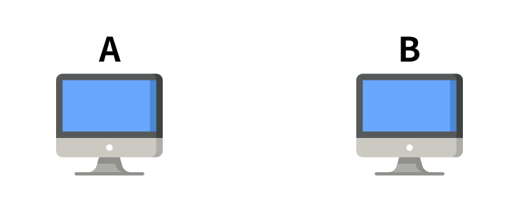
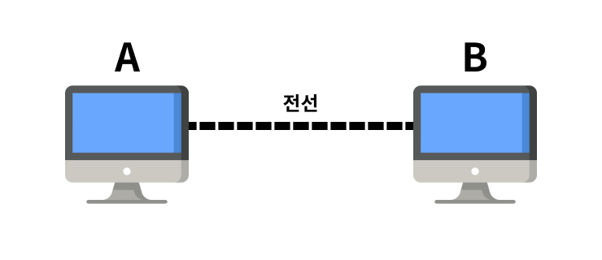
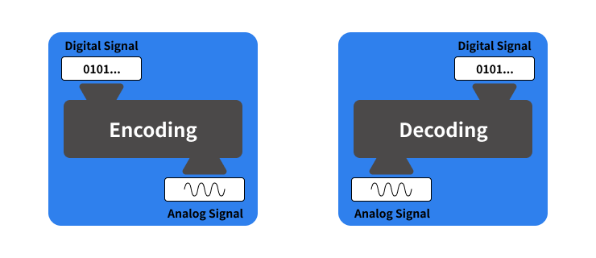
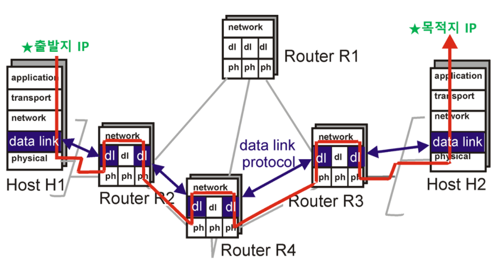
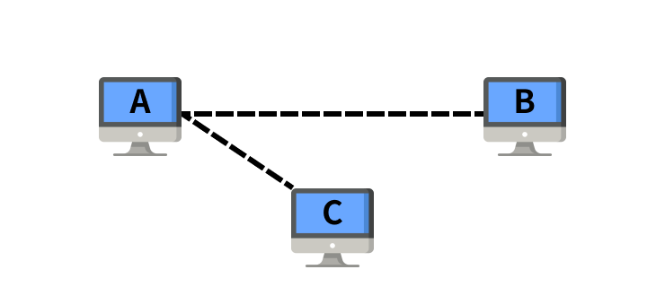
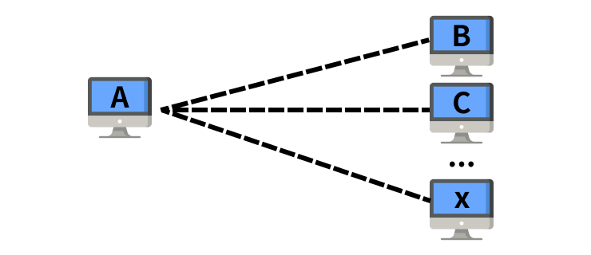
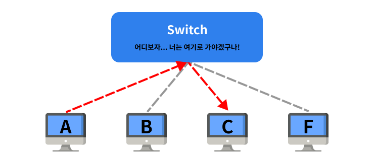

# HTTP

## HTTP와 HTTPS의 차이

### HTTP

HTTP란 Hyper Text Transper Protocol의 약자로, 웹에서 클라이언트와 서버 간 데이터를 주고 받는 규칙을 얘기합니다.

> 내가 이렇게 보내면, 이런 의미라는 거야
> 너가 이런걸 원하면, 이렇게 보내면 돼

#### HTTP 보안 문제

- 평문 통신이기 때문에, 중간에서 어떤 데이터를 주고 받는 지 데이터를 확인할 수 있다.
- 원본 데이터인지 확인할 수 없기 때문에 변조가 가능하다.
- 통신하는 상대(클라이언트 입장에서는 서버)를 확인하지 않기 때문에 위장이 가능하다.
  - 은행 사이트로 위장하여 개인정보를 탈취할 수 있다. 

### HTTPS

HTTPS는 HTTP + Secure. 즉, HTTP에서 보안이 더해진 것으로 데이터를 주고 받을 때 암호화한다는 것이 특징입니다. 이를 통해 클라이언트와 서버 간에 민감한 정보를 안전하게 주고받을 수 있습니다.

#### HTTPS 암호화 방식

1. 사이트에 접속할 때, 브라우저는 서버가 누구인지 확인하는 과정을 거칩니다. 이를 handshake라고 하는데, 이 과정에서 브라우저는 서버에게, 서버는 브라우저에게 랜덤한 데이터와 암호화된 인증서를 전달합니다.
   - 인증서는 공인된 기관인 CA에서만 발급이 가능하며, CA에 대한 정보는 브라우저에 저장이 되어있습니다.
2. 브라우저에 저장되어있는 CA의 공개키로 암호화된 인증서를 복호화합니다.
   - 복호화 시, 인증서와 함께 서버의 공개키를 얻을 수 있습니다.
   - 비대칭키를 이용해 암호화하여 통신하는 방식은, 대칭키를 이용해 통신하는 방식에 비해 시간이 많이 걸립니다. 따라서, 데이터를 주고 받을 때 서버의 공개키를 사용하지 않고, 대칭키를 만드는 데 사용합니다.
3. 클라이언트는 handshake 과정에서 주고 받았던 클라이언트의 랜덤한 데이터 + 서버의 랜덤한 데이터 + 서버의 공개 키를 이용해서 임시키를 발급하고, 서버에게 전달합니다.
   - 일련의 과정을 거쳐 대칭키를 생성합니다.
4. 대칭키를 통해 데이터를 암호화하여 주고 받습니다.

# OSI 7 Layers

## OSI 모형

> Open Systems Interconnection Reference Model

**컴퓨터 네트워크 프로토콜[1](#footnotea1) 디자인과 통신을 계층으로 나누어 설명한 모델.** 일반적으로 OSI 7계층(OSI 7 Layers)이라고 한다.

네트워크에서 통신이 일어나는 과정을 7단계로 나눈 것을 말한다.

### 프로토콜

프로토콜이란, 컴퓨터 간 통신을 위해 알고 있어야 하는 / 지켜야 하는 규칙이다.

시스템 간 **통신(데이터를 주고 받는 행위)을 하려면**, 서로가 **말하는 방식을 이해할 수 있어야** 하고, 이해하기 위해서는 **공통의 규칙이 있어야** 한다. 이 규칙을 정리한 것을 프로토콜이라 부르기로 했어요~

### 왜 OSI 모형을 만들었을까?

1. 초창기 여러 통신 업체들이 사용하는 장비들은 호환성이 없어, 다른 업체의 장비를 연결해서 사용하지 못했다.
2. 서로 다른 장비간 연결을 위해서는 표준 모델이 있어야 했다.
3. 국제표준기구 ISO에서 OSI 모델을 발표했다.

### 계층

7개의 계층으로 나누어져 있으며, 물데네전세표응 순서로 구성되어있다.

| #    | 계층 이름        | 데이터 단위      | 프로토콜                           |
| ---- | ---------------- | ---------------- | ---------------------------------- |
| 1    | 물리 계층        | bit              | DSL, ISDN 등                       |
| 2    | 데이터 링크 계층 | frame            | PPP, Ethernet, Token ring, wifi 등 |
| 3    | 네트워크 계층    | datagram, packet | IP, ICMP, ARP, RIP, BGP 등         |
| 4    | 전송 계층        | segment          | TCP, UDP, SCTP 등                  |
| 5    | 세션 계층        | message          | NetBIOS, TLS 등                    |
| 6    | 표현 계층        | message          | ASCII, MPEG 등                     |
| 7    | 응용 계층        | message          | HTTP, SMTP, FTP, SIP 등            |

## 계층 별 설명

### 1. Physical layer

장치 간 전기적 신호를 전달하는 계층이며, 데이터 frame 내부의 각 bit를 실제로 이동시키는 계층이다.

데이터를 송신하기 위해, 디지털 신호를 아날로그 신호로 변환하기도 하며, 아날로그 신호로 수신한 내용을 디지털 신호로 변환하기도 한다.

대표적인 장비: 허브, 리피터

#### 배경

> 두 대의 컴퓨터 A와 B가 통신하려면 어떻게 해야 할까?

~

가장 먼저 데이터를 주고받으려면 두 컴퓨터는 연결되어 있어야 할 것이다. 전선으로 A와 B를 연결해보자.

A에서 B로 데이터를 전달하고자 할 때, 두 컴퓨터 간 연결된 전선을 통해 데이터를 보내면 B 컴퓨터에서는 A에서 보낸 데이터를 확인할 수 있을 것이다.

하지만, 컴퓨터 내부에서 데이터는 0과 1(이진값)로 이루어져있기 때문에 전선을 통해 **데이터를 전달하기 위해서는 이진값을 신호(전자기 신호)로 변환**해 주는 과정을 반드시 거쳐야한다.

또한, 전송 매체인 전선은 그저 터널일 뿐이기 때문에 physical layer는 데이터를 전송하기 위해 얼마나 많은 수의 논리 채널이 필요한지 결정해야 한다. 

#### 하는 일

1. 데이터를 보내기 전,
   1. 이진 값(0, 1)을 아날로그 신호로 변환 (encoding)
   2. 데이터를 전달하기 위해 필요한 논리 채널의 수 결정
2. 데이터를 받은 후,
   1. 아날로그 신호를 이진 값으로 변환 (decoding)

#### 사용 예시

> 하드웨어적으로 구현되어 있음

- 네트워크 어뎁터
- 리피터
- 네트워크 허브
- 모뎀

### 2. DataLink layer

데이터링크 계층은 **직접 연결된 서로 다른 2개의 통신 장치 간의 데이터 전송을 담당**하는 계층이다.

#### 배경

> 여러 대의 컴퓨터가 통신하려면 어떻게 해야 할까?

A와 B는 서로 전선으로 연결되어 있고, 다른 컴퓨터는 연결되어있지 않기 때문에 데이터를 보낼 때 어디로 보낼 지 고민하지 않아도 된다.

- A에서 데이터를 보내면, 받는 곳은 당연히 B가 된다.

- B에서 데이터를 보내면, 받는 곳은 당연히 A가 된다.

만약 A에 C라는 컴퓨터를 더 연결하면 어떤 구조가 만들어질까?

통신할 컴퓨터의 수가 많지 않다면 이렇게 하나하나 연결할 수 있겠지만, 통신할 컴퓨터의 수가 100억대라면 연결할 수 있을까?

A에 100억개의 케이블을 연결할 수는 없을 것이다. 그렇다면 어떻게 해야할까?

다른 컴퓨터와 연결된 허브를 만들면 다음과 같은 그림이 된다.

직접 연결된 컴퓨터 사이(A와 Switch)에서의 데이터 통신이 제대로 이루어진다면(데이터가 온전히 전달이 된다면), A에서 바로 C로 보내지 않고 Switch를 거쳐서 보내도 된다.

#### 주요 역할

1. 프레이밍 (Framing)

   - 송신하는 경우

     데이터를 프레임(Frame) 단위의 데이터 유닛으로 나눈다.

   - 수신하는 경우

     물리 계층을 통해 수신한 신호(bit 단위)를 조합하여, 프레임(Frame) 단위의 정해진 크기의 데이터 유닛으로 만든다.

   데이터를 프레임화하여, 얻을 수 있는 이점

   1. Reliablity

      전송 시 생기는 오류에 의해 전체 파일을 다시 받아야 하는 불상사를 방지할 수 있다.

   2. Easier Validation

      크기가 작아져 유효성 검증이 용이하다.

   3. Starvation

      아주 덩치가 큰 파일이 통신을 점유하고 있을 때, 다른 데이터는 무한 대기

2. 흐름 제어(Flow Control)

   - 수신 측에 너무 많은 데이터를 보내면, 송신 측에서는 데이터가 버퍼에 쌓이게된다.

   - 버퍼사이즈 이상의 데이터가 쌓이게 되면 데이터의 손실이 발생한다.

   - **데이터를 받는 측의 처리 속도가 느릴 때, 데이터를 전송하는 측의 속도를 조정한다.**

3. 오류 제어(Error Control)

   전송 시 발생하는 오류를 검출하고, 이를 복원하거나 재전송한다.

4. 접근 제어(Access Control)

   연결된 통신 기기가 다수일 때, 데이터를 어디에 전송할 지 결정한다.

5. 동기화

   프레임의 시작과 끝을 구분하기 위하여 프레임을 동기화한다.

### 3. Network layer

기기에서 데이터그램(Datagram, 데이터 단위)이 가는 경로를 설정해주는 역할을 한다. 라우팅 알고리즘을 사용하여, 목적지에 도달하기 위한 최적의 경로를 선택하고 수신측으로 전송한다.
전송하는 데이터는 `패킷`단위로 분할하여 전송하고, 수신 측 네트워크 계층에서 다시 합쳐진다.
데이터링크 계층이 인접한 기기 간(Node to Node) 데이터 전송을 담당한다면, 네트워크 계층은 패킷이 목적지까지 성공적으로 도달하는 것을 담당한다.

- 관련 장비: 라우터, L3 스위치
- 어디로 가야하오

### 4. Transport layer

발신지에서 목적지 간 제어와 에러를 관리한다. 패킷의 전송이 유효한지 확인하고, 전송에 실패된 패킷을 다시 보내는 것과 같은 "신뢰성 있는 통신"을 보장하며, 헤드에는 `세그먼트`가 포함된다.

- 목적: 발신지에서 목적지까지 데이터가 안정적으로 전송되는 것

- 하는 일
  - 종단 시스템 간의 전송 연결 설정, 데이터 전송, 연결 해제
  - 주소 설정, 다중화(분할 및 재조립), 오류 제어, 흐름 제어
- 관련 장비: 게이트웨이, L4 스위치

### 5. Session layer

통신 세션을 구성하는 계층으로, `포트(port)`번호를 기반으로 연결한다. 통신장치 간의 상호작용을 설정하고 유지하며 동기화한다.
동시 송수신(Duplex), 반이중(Half-Duplex), 전이중(Full-Duplex) 방식의 통신과 함께 체크 포인팅과 유후, 종료, 다시 시작 과정 등을 수행한다.

- 대화 구성 및 동기 제어, 데이터 교환 관리 기능
- 연결과 연결을 유지해주는 세션

#### 세션

세션이란, 두 이용자 사이의 연결을 의미한다. 세션 계층은 연결을 원하는 두 이용자 사이의 세션 설정 및 유지를 가능하게 해줌으로써 두 이용자 간의 대화를 관리하고, 파일 복구 등의 기능을 지원한다.

### 6. Presentation layer

- 응용 계층 => 표현 계층

  응용 계층으로부터 받은 데이터를 세션 계층으로 보내기 전에 통신에 적당한 형태로 "변환"한다.

- 세션 계층 => 표현 계층

  세션 계층으로부터 받은 데이터를 응용 계층에 맞게 "변환"한다.

송신측과 수신측 사이에서 데이터의 형식(png, jpg, hwp...)을 정해준다. 받은 데이터를 코드 변환, 구문 검색, 암호화, 압축의 과정을 통해 올바른 표준 방식으로 변환해준다.

서로 다른 데이터 표현 형태를 갖는 시스템 간의 상호 접속을 위해 필요한 계층이다.

코드 변환, 데이터 암호화, 데이터 압축, 구문 검색, 정보 형식 변환, 문맥 관리의 기능을 한다.

### 7. Application layer

응용계층은 사용자와 바로 연결되어 있으며, 응용 SW를 도와주는 계층이다. 사용자로부터 정보를 입력받아 하위 계층으로 전달하고 / 하위 계층에서 받은 데이터를 사용자에게 전달한다.

파일 전송, DB, 메일 전송 등 여러가지 응용 서비스를 네트워크에 연결해주는 역할을 한다.

## TCP/IP 모델

OSI 참조 모델은 참조 모델일 뿐, 실제 사용되는 인터넷 프로토콜은 7계층 구조를 완전히 따르지는 않는다.
인터넷 프로토콜 스택은 현재 대부분 TCP/IP를 따른다.

TCP/IP는 인터넷 프로토콜 중 가장 중요한 역할을 하는 TCP와 IP의 합성어로 데이터의 흐름 관리, 정확성 확인, 패킷의 목적지 보장을 담당한다.

- TCP: 데이터의 정확성 확인
- IP: 데이터를 목적지까지 전송

---

<b id="footnotea1">1<b> 컴퓨터끼리 "데이터 통신"을 원활하게 하기 위해 정해놓은 통신 규약(=약속, 규칙) [↩](#a1)

교류: 시간에 따라 전압이 달라지는 전기

---

참고

- [youtube - 10분 테코톡 히히의 OSI 7 Layer](https://youtu.be/1pfTxp25MA8)

- [Physical Layer of internet model: Analog, Digital Data and Signal](https://www.indiastudychannel.com/resources/171556-Physical-Layer-of-internet-model-Analog-Digital-Data-and-Signal.aspx)

- [위키백과 - OSI_모형](https://ko.wikipedia.org/wiki/OSI_%EB%AA%A8%ED%98%95)

