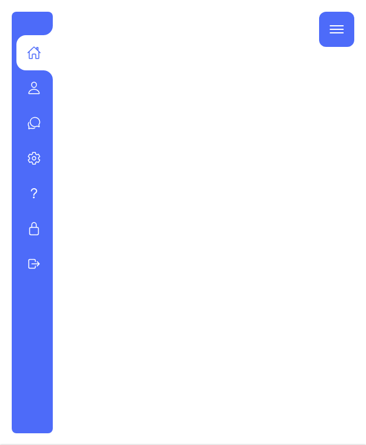

# CSS


## Navigation Menu | Curved Active tab


#### 참고

[Hover 버전](https://youtu.be/pubrK_AmqRg)

[Toggle 버전](https://youtu.be/P_A2kNpyQBs)


#### 결과물

[codesandbox](https://codesandbox.io/s/sidebar-menu-yesru?file=/index.html)





## Scroll 없애기

Scrollbar가 생기는 요소를 `element`라고 했을 때,

```css
element {
    /* for Firefox */
    scrollbar-width: none;
    /* for IE, Edge */
    -ms-overflow-style: none;
}

/* For Chrome, Safari and Opera */
element::-webkit-scrollbar {
    display: none;
}
```

