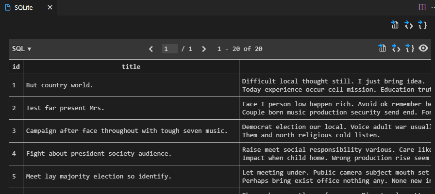
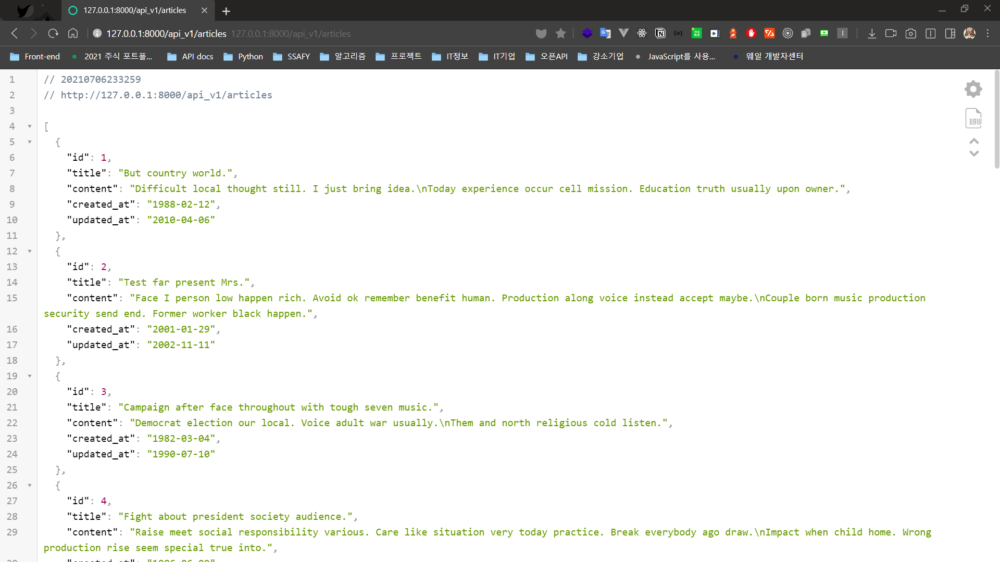
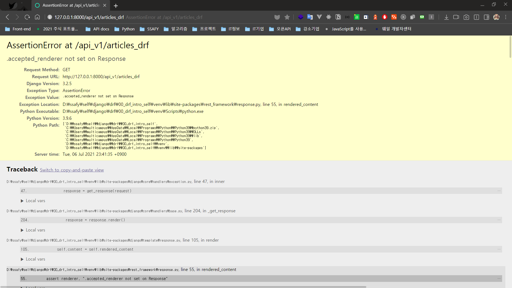
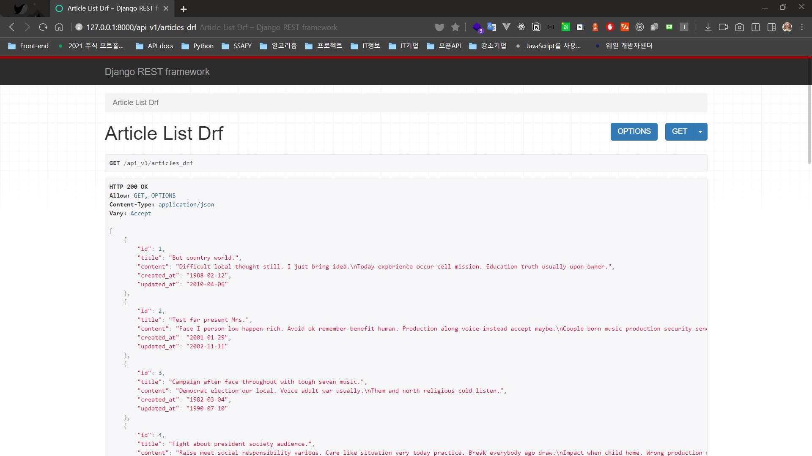

> 210706 TIL 정리 시작날


### DRF

#### 목표

1. Django-REST-framework 정리
2. Django-REST-framework 예제 프로젝트


#### 정의

- Django-REST-framework

  Web API Server를 위한 프레임워크

  Django 프로젝트에 패키지로 설치하는 방식으로 구성한다.


#### 예제 프로젝트

1. 파이썬 가상 환경 세팅 후 필요 패키지 설치

   **bash**

   ```bash
   # 가상환경 생성
   $ python -m venv venv
   # 가상환경 활성화
   $ source venv/Scripts/activate
   # 패키지 설치
   $ pip install black django djangorestframework django-seed
   # 설치한 패키지 목록 저장
   $ pip freeze > requirements.txt
   ```

   

   **settings.py**

   ```python
   INSTALLED_APPS = [
       'rest_framework',
       'django_seed',
       # ...
   ]
   ```

   > 패키지 설명
   >
   > - black: 파이썬 포맷터 (코드 작성 규칙에 맞게 자동 변환합니다.)
   > - django: django cli
   > - djangorestframework: DRF
   > - django-seed: 더미 데이터를 생성할 때 사용

   

2. 장고 프로젝트 생성

   ```bash
   $ django-admin startproject config .
   ```

   

3. `Articles` App 생성

   **bash**

   ```bash
   $ python manage.py startapp articles
   ```

   

   **settings.py**

   ```python
   INSTALLED_APPS = [
       'articles',
       # ...
   ]
   ```

   

4. 모델링

   **articles/models.py**

   ```python
   class Article(models.Model):
       title = models.CharField(max_length=100)
       content = models.TextField()
       created_at = models.DateField(auto_now_add=True)
       updated_at = models.DateField(auto_now=True)
   ```
   
   **bash**
   
   ```bash
   $ python manage.py makemigrations
   $ python manage.py migrate
   ```
   
   > makemigrations
   >
   > ​	각 앱에 있는 `models.py`의 변동사항을 확인하여, migrations를 만든다.
   >
   > migrate
   >
   > ​	DB Schema에 migrations 내용을 적용한다.
   
   
   
5. Seed 생성

   [django-seed Github](https://github.com/Brobin/django-seed)

   **bash**

   ```bash
   $ python manage.py seed articles --number=20
   ```

   

   > 20개의 더미데이터가 만들어졌습니다.

   

6. Serializer 클래스 생성

   Serializer 클래스는 Django의 Form과 유사합니다.

   **articles/serializers.py**

   ```python
   from rest_framework import serializers
   from .models import Article
   
   
   class ArticleSerializer(serializers.ModelSerializer):
       class Meta:
           model = Article()
           fields = "__all__"
   ```

   > serializers.ModelSerializer를 상속받아, 생성한 모델 클래스와 연결된 serializer를 만드는 코드

   

7. api를 제공하는 view 함수 만들기

   **articles/views.py**

   ```python
   from django.http.response import JsonResponse
   from .models import Article
   from .serializers import ArticleSerializer
   
   
   def article_list(requests):
       articles = Article.objects.all()
       # QuerySet을 Serializer의 'instance'라는 이름의 인자로 전달합니다.
       # articles는 dictionary 형태가 아닌 Array 형태를 갖기 때문에 many=True도 함께 전달합니다.
       serializer = ArticleSerializer(instance=articles, many=True)
       # 실제로 전달할 데이터는 serializer.data 입니다.
       # 이 데이터 역시 dictionary 형태가 아니기 때문에 safe=False도 함께 전달합니다.
       return JsonResponse(data=serializer.data, safe=False)
   ```

   

8. url 설정

   **config/urls.py**

   ```python
   from django.contrib import admin
   from django.urls import path, include
   
   urlpatterns = [
       path("admin/", admin.site.urls),
       include("api_v1/", "articles.urls"),
   ]
   ```

   

   **articles/urls.py**

   ```python
   from django.urls import path
   from . import views
   
   urlpatterns = [
       path("articles", views.article_list),
   ]
   ```

   

9. 서버 실행 후 확인

   

   > Serializer 클래스를 만들 때, 전체 필드를 가져오도록 하였기에 모든 항목이 출력되는 것을 확인할 수 있습니다.

   

   

#### 공부 더하기

1. Django Rest framework에도 Response라는 클래스가 있는데, Django의 JsonResponse와 어떤 점이 다를까?

   **views.py**

   ```python
   from rest_framework import Response
   
   def article_list_drf(requests):
       articles = Article.objects.all()
       serializer = ArticleSerializer(instance=articles, many=True)
       return Response(data=serializer.data)
   ```

   

   > 어라?

   **DRF 공식문서**

   > Unless you want to heavily customize REST framework for some reason, you should always use an `APIView` class or `@api_view` function for views that return `Response` objects. Doing so ensures that the view can perform content negotiation and select the appropriate renderer for the response, before it is returned from the view.

   

   **views.py**

   ```python
   from rest_framework.decorators import api_view
   
   @api_view(["GET"])
   def article_list_drf(requests):
       articles = Article.objects.all()
       serializer = ArticleSerializer(instance=articles, many=True)
       return Response(data=serializer.data)
   ```

   

   > DRF 레이아웃의 API

   


