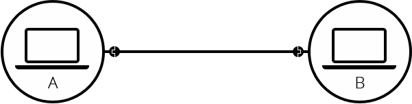
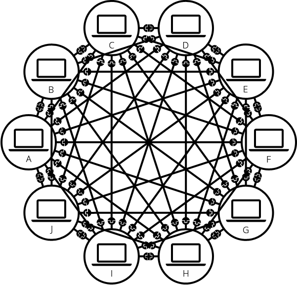
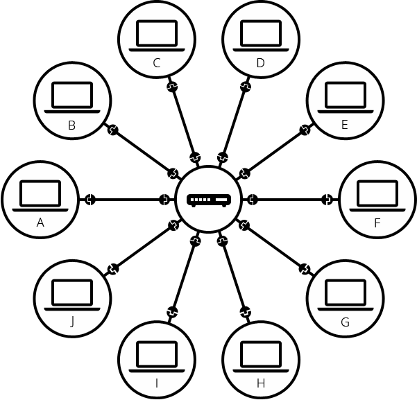
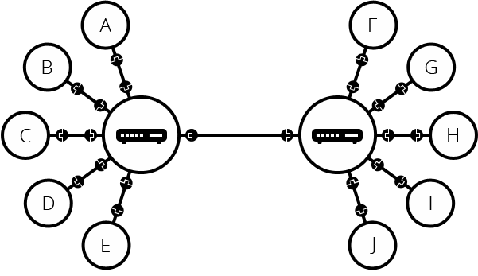
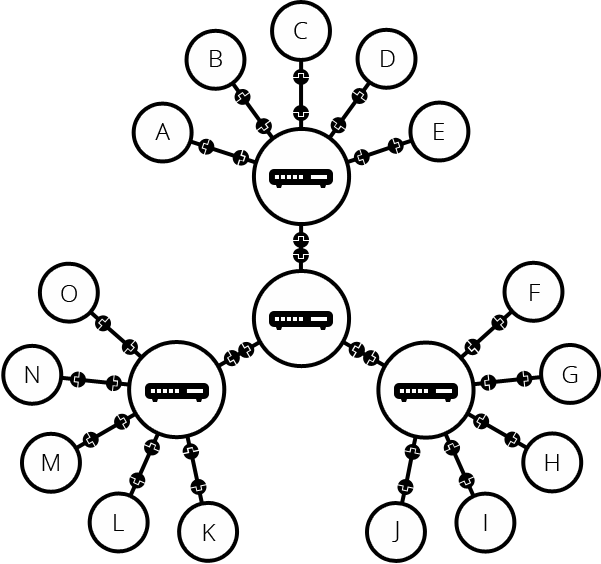
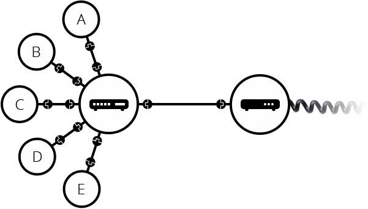
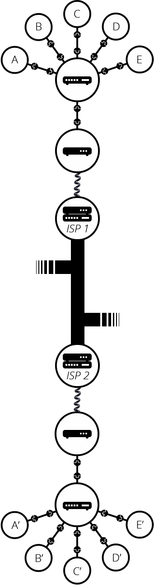

# Internet

## How does the Internet work?

### 요약

- 인터넷은 프로토콜의 집합으로 표현되는 디자인 철학이자 아키텍처이다.
- 컴퓨터와 컴퓨터가 서로 자료를 주고 받으려면, 연결되어야 한다.
  컴퓨터와 컴퓨터가 연결되려면 어떻게 해야 할까?

### 네트워크

#### 1단계: 두 컴퓨터를 연결하기

두 컴퓨터를 가장 쉽게 연결하는 방법은 전선과 같은 케이블로 연결하는 것입니다.

#### 2단계: 10대의 컴퓨터를 연결하기 (라우터)

만약 10대의 컴퓨터를 동일한 방법(전선)으로 연결해봅시다.

모두 연결한 것을 보니 컴퓨터는 나머지 9대의 컴퓨터와 연결되어야 합니다. 총 45개의 케이블이 필요하죠.

10대까지는 연결을 했다고 하더라도, 1000대를 연결하려면 999개의 전선을 컴퓨터와 연결해야하니 확장성이 떨어질 것이라는 생각이 듭니다.

우리가 도로를 만들 때, 서로의 집으로 향하는 도로를 만들지 않는 것 처럼 컴퓨터 간의 연결도 중간 허브가 있다면 연결을 조금 더 단순하게 바꿀 수 있지 않을까요?

우리는 중간 허브역할을 하는 컴퓨터를 **라우터**라고 부르기로 했어요!

라우터의 역할은 A라는 컴퓨터에서 C라는 컴퓨터로 향하는 정보를 받았을 때, 다음 행선지를 지정해주는 역할을 합니다.

라우터를 추가하면, 10대의 컴퓨터 네트워크에는 10개의 케이블만 있으면 되며, 각 컴퓨터는 라우터로 향하는 전선 하나만 있으면 됩니다.

#### 3단계: 라우터 간 연결

하나의 라우터로 연결이 가능한 컴퓨터의 개수는 제한이 있습니다. 그 이상의 컴퓨터를 연결하려면 어떻게 해야 할까요?

여러 컴퓨터와 연결되어 있는 라우터와 라우터 즉, 라우터끼리 연결해주면 그 문제를 해결할 수 있습니다.

라우터끼리 더 많이 연결한다면?

이런식으로 우리는 "근거리(전선으로 연결할 수 있는)"에 있는 컴퓨터를 연결할 수 있습니다.

#### 4단계: 모뎀과 ISP

여러 컴퓨터를 연결하는 방법은 있지만, 아주 먼 지역에 있는 다른 컴퓨터와 연결을 하려면 어떻게 해야 할까요?

우리는 이미 먼 지역에 있는 사람들과 통화를 할 수 있죠. 이처럼 전화 시설은 이미 세계 어느 곳에든 연결되어 있습니다. 이 전화 시설을 이용한다면 먼 지역에 있는 컴퓨터와 연결이 가능할 것입니다.

그렇다면, 전화 시설을 이용하기 위해 어떤 과정을 거쳐야 하는지 알아야겠네요.

네트워크를 전화 시설과 연결하기 위해선, 모뎀이라는 특수한 장비가 필요합니다. 이 모뎀은 네트워크에서 사용하고 있는 **디지털 신호**를 전화 시설에서 처리 할 수 있는 **"아날로그 신호"**로 변환하여 전송하거나, 아날로그 신호를 받아 디지털 신호로 읽어내는 작업을 수행합니다.

> 모뎀을 통해 우리의 네트워크는 전화 시설을 통해 확장이 가능하다.

모뎀을 통해 보낸 우리의 정보는 목적지에 어떻게 도달할 수 있을까요?

네트워크는 인터넷 서비스 제공 업체(Internet Service Provider, ISP)에 연결됩니다. ISP는 우리의 로컬 네트워크 상위에서 다른 로컬 네트워크와도 연결되어 있으며, 다른 ISP의 라우터에도 접근이 가능합니다. (한국: KT, SKT, LGU 등)

우리가 보내는 메세지는 ISP의 네트워크를 통해 목적지와 연결된 네트워크로 전달됩니다.

> ISP까지 네트워크를 확장하여, 먼 거리에 있는 네트워크와 연결이 가능합니다.

### 인터넷과 웹

인터넷은 수십억대의 컴퓨터를 모두 연결하는 기술 인프라입니다. 연결된 컴퓨터 중 일부는 "웹 서버"로서 웹 브라우저가 이해할 수 있는 서비스를 제공합니다.

다시 한 번 말하지만, **인터넷은 인프라입니다. 웹은 그 인프라 위에 구축된 서비스**입니다. 우리는 웹 뿐만 아니라 인터넷 위에 구축된 다른 서비스들(이메일 등)도 있다는 것을 잊어선 안됩니다.

### IP Address and DNS

#### IP Address

- Internet Protocal Address
- 네트워크에 연결되어 있는 컴퓨터의 네트워크 공간 상에서의 주소

- IPv4

  3자리 숫자의 4묶음으로 되어 있으며, 각 묶음은 32 bit로 표현이 가능하다.

  약 40억개의 조합

- IPv6

  IPv4 주소 할당량이 거의 소진되고 있다는 한계점의 대안으로 제안된 주소체계

  휴대폰 및 컴퓨터에 할당되어 적용되고 있다.

#### DNS

- Domain Name System

- IP Address를 도메인 이름과 매칭을 시켜놓은 전화번호부와 같다.

- 동작 방식

  1. 인터넷 브라우저에 주소를 입력한다.

     `www.naver.com`

  2. 브라우저와 OS에서 캐싱한 IP 주소(도메인에 해당하는)가 있는지 확인한다.

     - 없다면? 다음으로

  3. DNS 서버에 해당 주소에 대응되는 IP 주소를 요청한다.

     1. DNS 서버는 다른 DNS 서버와 함께 건네받은 주소(`www.naver.com`)의 IP 주소를 찾는다.

  4. 응답 받은 IP 주소로 목적지를 설정한다.

## What is HTTP?

### 1. HTTP란 무엇인가?

- HTTP = Hyper Text Transfer Protocol = Hyper Text를 전송하기 위한 약속(방법)
- **클라이언트와 서버 사이에 이루어지는 요청/응답 프로토콜**
- 프로토콜을 따르는 컴퓨터끼리는 데이터를 주고 받을 수 있다.
- **OSI 모형의 응용 계층**에 해당한다.
- 연결 상태를 유지하지 않는 **비연결성 프로토콜**

#### HTTP 동작

1. 클라이언트인 웹 브라우저가 HTTP를 통해, 서버로 웹페이지를 요청한다.

   Client => Server

2. 서버는 요청에 응답하여 필요한 정보를 사용자에게 전달한다.

   Server => Client

#### 요청

1. 요청 내용

   `GET www.naver.com HTTP/1.1`

2. 헤더

   `Content-Type: text/html`

3. 빈 줄

4. 기타 메시지

##### 요청 메서드

1. GET: 자료 요청
2. POST: 자료 생성
3. PUT: 자료 수정
4. DELETE: 자료 삭제

#### 응답

1. 상태표시 행

   상태코드와 메시지를 포함한다.

2. 헤더

3. 빈 줄

4. 기타 메시지

##### 응답 코드

> 자주 볼 수 있었던 응답 코드 위주로 정리

- 2XX: 성공
  - 200 (OK)
    오류 없이 전송 성공
  - 201 (Created)
    요청 성공, 그 결과 새로운 리소스가 생성되었습니다.
- 3XX: 리다이렉션
  - 301 (Moved Permanently)
    요청한 리소스의 URI가 변경되었음
  - 302 (Found)
    요청한 리소스의 URI가 일시적으로 변경되었음
  - 304 (Not Modified)
    클라이언트에게 응답이 수정되지 않았음을 알려줌, 응답의 캐시된 버전을 사용
- 4XX: 에러
  - 400 (Bad Request)
    서버가 요청을 이해할 수 없음
  - 401 (Unauthorized)
    요청에 대한 인증이 필요함 (누구인지 모름)
  - 403 (Forbidden)
    클라이언트가 콘텐츠에 접근할 권한을 갖고 있지 않음 (누구인지 알고 있음)
  - 404 (Not Found)
    요청받은 리소스를 찾을 수 없음
  - 405 (Method Not Allowed)
    요청한 메소드는 사용할 수 없음
- 5XX: 서버 에러
  - 500 (Internal Server Error)
    서버가 처리 방법을 모르는 상황이 발생했음
  - 502 (Bad Gateway)
    게이트웨이로 작업하는 동안 잘못된 응답을 수신함

---

참고

- [인터넷 프로토콜 스위트](https://ko.wikipedia.org/wiki/%EC%9D%B8%ED%84%B0%EB%84%B7_%ED%94%84%EB%A1%9C%ED%86%A0%EC%BD%9C_%EC%8A%A4%EC%9C%84%ED%8A%B8)

- [The Internet: IP Address & DNS](https://youtu.be/5o8CwafCxnU)
- [How DNS works](https://howdns.works/)

