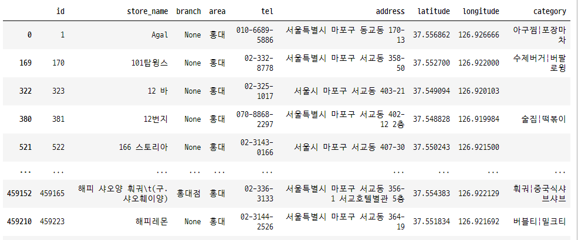
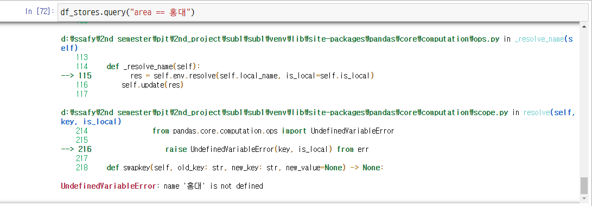

[TOC]


# Numpy

Numerial Python

Python에서 대규모 다차원 배열을 다룰 수 있게 도와주는 라이브러리

Python 대표적인 라이브러리

1. Pandas
2. Numpy
3. Matplotlib


## Why?

데이터의 대부분은 숫자 배열로 볼 수 있다. (다룰 수 있다)

반복문 없이 배열 처리 가능!

파이썬 리스트에 비해, 빠른 연산을 지원하고 메모리를 효율적으로 사용한다.


## Python List vs Numpy

### Python List

```python
list_arr = list(range(5))
print(list_arr)       # [0, 1, 2, 3, 4] => 쉼표로 구분
print(type(list_arr)) # <class 'list'>
```

### Numpy

```python
import numpy as np
np_arr = np.array(range(5))
print(np_arr)       # [0 1 2 3 4] => 띄어쓰기로 구분
print(type(np_arr)) # <class 'numpy.ndarray'>
```

- ndarray란?

  n차원의 array


## 배열의 기초


### 배열의 데이터 타입 `dtype`

파이썬 리스트와 달리 같은 데이터 타입만 저장할 수 있다.

```python
import numpy as np

arr = np.array([0, 1, 2, 3, 4], dtype=float)
print(arr) # [0. 1. 2. 3. 4.]
print(arr.dtype) # "float64"
print(arr.astype(int)) # [0 1 2 3 4]
```

- `int` 정수형 타입
- `float` 실수형 타입
- `str` 문자열 타입
- `bool` 부울 타입

### 배열의 속성

`ndarray` 의 차원 관련 속성

- `ndim`: n + dimension (N차원)
- `shape`: 모양

```python
arr = np.array([0, 1, 2, 3])
print(arr.ndim) # 1
print(arr.shape) # (4,)

arr2 = np.array([[0, 1, 2], [3, 4, 5]])
print(arr.ndim) # 2
print(arr.shape) # (2, 3)
print(arr.size) # 6
print(len(arr)) # 2
```

## Indexing & Slicing

### Indexing

인덱스로 값을 찾기

```python
x = np.arange(7)

print(x) # [0 1 2 3 4 5 6]
print(x[3]) # 3
print(x[7]) # 아무것도 출력되지 않음
# IndexError: index 7 is out of bounds

x[0] = 10
print(x) # [10 1 2 3 4 5 6]
```

```python
x = np.arange(1, 13, 1) # 1 ~ 12까지 1씩 증가
x.shape = 3, 4          # 3 X 4 행렬로 변환
print(x)
# [[1 2 3 4],
#  [5 6 7 8],
#  [9 10 11 12]]

print(x[2, 3]) # 12
```


### slicing

인덱스의 값으로 배열의 일부분을 가져옴

`[start:end:step]`: start 이상 end 미만의 값을 step 간격으로

```python
x = np.arrange(7)
print(x) # [0 1 2 3 4 5 6]

print(x[1:4]) # [1 2 3]
print(x[1:]) # [1 2 3 4 5 6]
print(x[:4]) # [0 1 2 3]
print(x[::2]) # [0 2 4 6]
```


```python
x = np.arrange(1, 13, 1)
x.shape = 3, 4
print(x)
# [[1 2 3 4],
#  [5 6 7 8],
#  [9 10 11 12]]
print(x[1:2, :2:3])
# [[5]]
print(x[1:, :2])
# [[5 6],
#  [9 10]]
```


### Boolean indexing

배열의 각 요소 선택 여부를 Boolean mask를 이용하여 지정하는 방식

조건을 충족하는지 확인한다.

- `조건`: 조건을 만족하는지 확인하여 T/F를 리턴
- `array[조건]`: 조건을 만족하는 값만 리턴

```python
x = np.arrange(7)

print(x)
# [0 1 2 3 4 5 6 7]

print(x < 3)
# [True True True False False False False False]
print(x[x < 3])
# [0 1 2]

print(x > 7)
# [False False False False False False False]
print(x[x > 7])
# []
```


### Fancy indexing

배열의 각 요소 선택을 index 배열을 전달하여 지정하는 방식

> 2차원은 행을 선택하는 것

```python
x = np.arange(6, -1, -1)
print(x)
# [6 5 4 3 2 1 0]

print(x[[1, 3, 5]])
# [5 3 1]
```

```python
x = np.arange(1, 13, 1).reshape(3, 4)

print(x[[0, 2]])
# [[1 2 3 4],
#  [9 10 11 12]]
```


# Pandas


## Series

Series는 Value를 ndarray 형태로 가지고 있다.

Series는 Series라는 형태이며, 그 안에 들어간 value가 ndarray 형태인 것

```python
import pandas as pd
data = pd.Series([1, 2, 3, 4])
print(data)
# index value
# 0    1
# 1    2
# 2    3
# 3    4
# dtype: int64

print(type(data))
# pandas.core.series.Series

print(data.values)
# array([1, 2, 3, 4], dtype=int64)

print(type(data.values))
# numpy.ndarray
```


`dtype` 인자로 데이터 타입을 지정할 수 있음

```python
print(pd.Series([1, 2, 3, 4], dtype="string"))
# 0    1
# 1    2
# 2    3
# 3    4
# dtype: string
```


인덱스를 지정할 수 있고, 인덱스로 접근이 가능하다.

```python
data = pd.Series([1, 2, 3, 4], index=["a", "b", "c", "d"])

print(data["a"])
# 1

data["c"] = 1000
print(data)
# a         1
# b         2
# c    100000
# d         4
# dtype: int64
```


Dictionary를 활용하여 Series 생성 가능

```python
population_dict = {
    'china': 141500,
    "japan": 12718,
    "korea": 5180
}
population = pd.Series(population_dict)

print(population)
# china    141500
# japan     12718
# korea      5180
# dtype: int64
```


## DataFrame


### DataFrame

여러개의 Series가 모여서 행과 열을 이룬 데이터

> Series + Series + ... => DataFrame


#### Series를 이용해서 DataFrame 만들기

```python
# GDP Series 생성
gdp_dict = {
    "china": 1409250000,
    "japan": 516700000,
    "korea": 169320000,
    "usa": 2041280000
}

gdp = pd.Series(gdp_dict)

# Population Series 생성
population_dict = {
    'china': 141500,
    "japan": 12718,
    "korea": 5180,
    "usa": 32676
}
population = pd.Series(population_dict)

# country DataFrame 생성
country = pd.DataFrame({
    "gdp": gdp,
    "population": population,
})
print(country)
##############################
              gdp  population
china  1409250000      141500
japan   516700000       12718
korea   169320000        5180
usa    2041280000       32676
```


#### Dictionary를 활용하여 DataFrame 만들기

```python
data = {
    "country": ["china", "japan", "korea", "usa"],
    "gdp": [1409250000, 516700000, 169320000, 2041280000],
    "population": [141500, 12718, 5180, 32676]
}

country = pd.DataFrame(data)
print(country)
####################################
  country         gdp  population
0   china  1409250000      141500
1   japan   516700000       12718
2   korea   169320000        5180
3     usa  2041280000       32676
####################################

# index를 country 컬럼으로 설정
country = country.set_index("country")
print(country)
####################################
                gdp  population
country                        
china    1409250000      141500
japan     516700000       12718
korea     169320000        5180
usa      2041280000       32676
####################################
```


```python
# 모양 확인
print(country.shape)
# (4, 2)

# 크기 확인
print(country.size)
# 8

# 차원 확인
print(country.ndim)
# 2

# 값 확인
print(country.values)
# [[1409250000     141500]
#  [ 516700000      12718]
#  [ 169320000       5180]
#  [2041280000      32676]]
```


#### 저장 & 로드

```python
country.to_csv("./country.csv")
country.to_excel("country.xlsx")

country = pd.read_csv("./country.csv")
country = pd.read_excel("country.xlsx")
```


## 데이터 선택 및 변경하기

### 데이터 선택 - Indexing, Slicing

#### .loc

명시적인 인덱스를 참조하는 인덱싱/슬라이싱

```python
country.loc["china"]

country.loc(["japan":"korea", :"population"])
# japan부터 korea까지 (korea 포함)

```


#### .iloc

정수 인덱스를 이용한 인덱싱/슬라이싱

```python
country.iloc[0]

country.iloc[1:3, :2]
# 1부터 3미만까지 (3을 포함하지 않음)
```


### 데이터 선택 - 컬럼 선택

컬럼명을 활용하여 데이터를 선택할 수도 있다.

```python
country["gdp"] # Series (DataFrame의 컬럼을 잘라 Series를 반환)
country[["gdp"]] # DataFrame 자동 전환
```


### 데이터 선택 - 조건 활용

Masking 연산이나 query 함수를 활용하여 조건에 맞는 DataFrame행 추출 가능

```python
stores[stores["area"] == "홍대"]
```




query 함수 활용(정수형 타입이 맞아야 한다.)




### 데이터 변경 - 컬럼 추가

Series간 연산자 활용 가능

```python
gdp_per_capita = country["gdp"] / country["population"]
country["gdp_per_capita"] = gdp_per_capita
```


### 데이터 변경 - 데이터 추가/수정

```python
df = pd.DataFrame(columns = ["이름", "나이", "주소"])
df.loc[0] = ["병훈", "30", "군포"]
df.loc[1] = {"이름": "민수", "나이": "31", "주소": "서울"}
```


### 데이터 변경 - NaN 컬럼 추가

NaN값으로 초기화 한 새로운 컬럼 추가

```python
df["전화번호"] = np.nan # Numpy의 not a number
df.loc[0, "전화번호"] = "01012341234"
```


### 데이터 변경 - 컬럼 삭제

DataFrame에서 컬럼 삭제 후 원본 변경

```python
df.drop("전화번호", axis=1, inplace=True)
# axis = 1: 열의 방향 / axis = 0: 행의 방향
# inplace = True: 원본 변경 / inplace = False: 원본 변경하지 않음
```


# 심화

## DataFrame

### sort_values

컬럼을 기준으로 값을 정렬합니다.

```python
import numpy as np
import pandas as pd

print("DataFrame: ")
df = pd.DataFrame({
    'col1' : [2, 1, 9, 8, 7, 4],
    'col2' : ['A', 'A', 'B', np.nan, 'D', 'C'],
    'col3': [0, 1, 9, 4, 2, 3],
})
print(df, "\n")


# 정렬 코드 입력해보기    
# 1. col1을 기준으로 오름차순으로 정렬하기.
sorted_df1 = df.sort_values("col1", ascending=True)
print(sorted_df1)


# 2. col2를 기준으로 내림차순으로 정렬하기.
sorted_df2 = df.sort_values("col2", ascending=False)
print(sorted_df2)

# 3. col2를 기준으로 오름차순으로, col1를 기준으로 내림차순으로 정렬하기.
sorted_df3 = df.sort_values(["col2", "col1"], ascending=[True, False])
print(sorted_df3)
```


### count

데이터 개수 확인 (Default: NaN값은 제외합니다)


### max, min

최대, 최소값 확인 가능

Default: 열 기준, NaN값 제외


### sum, mean

합계 및 평균 계산

Default: 열 기준, NaN값 제외


### axis, skipna

axis, skipna 인자를 활용하여, 합계 및 평균 계산

```python
df.sum(axis = 1) # 행 기준 합계
df.mean(axis = 1, skipna = False) # 행 기준, NaN 포함 평균
```


NaN이 포함된 연산은 NaN을 리턴하므로, 따로 처리해주어야 한다.

### Fillna (NaN 처리)

```python
B_avg = df["math"].mean()
df["math"] = df["math"].fillna(B_avg)
# df 데이터 프레임에서 math 컬럼에 있는 NaN을 B_avg로 대체

df.mean(axis=1, skipna=False)
```

```python
import numpy as np
import pandas as pd

data = {
    'korean' : [50, 60, 70],
    'math' : [10, np.nan, 40]
}
df = pd.DataFrame(data, index = ['a','b','c'])
print(df, "\n")

# 각 컬럼별 데이터 개수
col_num = df.count()
print(col_num, "\n")

# 각 행별 데이터 개수
row_num = df.count(axis = 1)
print(row_num, "\n")

# 각 컬럼별 최댓값
col_max = df.max()
print(col_max, "\n")

# 각 컬럼별 최솟값
col_min = df.min()
print(col_min, "\n")

# 각 컬럼별 합계
col_sum = df.sum()
print(col_sum, "\n")

# 컬럼의 최솟값으로 NaN값 대체
math_min = df["math"].min()
df['math'] = df["math"].fillna(math_min)
print(df, "\n")

# 각 컬럼별 평균
col_avg = df.mean()
print(col_avg, "\n")
```


## 그룹으로 묶기


### group by

```python
df = pd.DataFrame({
    "data1": range(6),
    "data2": [4, 3, 4, 6, 6, 9],
    "key": ["A", "B", "C", "A", "B", "C"]
})

df.groupby("key").sum()

df.groupby(["key", "data1"]).sum()
```

```python
import numpy as np
import pandas as pd

df = pd.DataFrame({
    'key': ['A', 'B', 'C', 'A', 'B', 'C'],
    'data1': [1, 2, 3, 1, 2, 3],
    'data2': [4, 4, 6, 0, 6, 1]
})
print("DataFrame:")
print(df, "\n")

# groupby 함수를 이용해봅시다.
# key를 기준으로 묶어 합계를 구해 출력해보세요.
print(df.groupby("key").sum())


# key와 data1을 기준으로 묶어 합계를 구해 출력해보세요.
print(df.groupby(["key","data1"]).sum())
```


### aggregate

groupby를 통해 집계를 한번에 계산하는 방법

```python
df.groupby("key").aggregate([min, sum, max])

df.groupby("key").aggregate({
    "data1": "min",
    "data2": max
})
```

```python
import numpy as np
import pandas as pd

df = pd.DataFrame({
    'key': ['A', 'B', 'C', 'A', 'B', 'C'],
    'data1': [0, 1, 2, 3, 4, 5],
    'data2': [4, 4, 6, 0, 6, 1]
})
print("DataFrame:")
print(df, "\n")

# aggregate를 이용하여 요약 통계량을 산출해봅시다.
# 데이터 프레임을 'key' 칼럼으로 묶고, data1과 data2 각각의 최솟값, 중앙값, 최댓값을 출력하세요.
print(df.groupby("key").aggregate(["min", "mean", "max"]))


# 데이터 프레임을 'key' 칼럼으로 묶고, data1의 최솟값, data2의 합계를 출력하세요.
print(df.groupby("key").aggregate({
    "data1": "min",
    "data2": "sum"
}))
```


### filter

그룹 속성을 기준으로 데이터 필터링


### Apply

함수 적용


### get_group

key값으로 데이터를 가져올 수 있다.


# Matplotlib


## 그래프 그리기


### Line plot

```python
import numpy as np
import pandas as pd
from matplotlib.pyplot as plt
```

```python
fig, ax = plt.subplots()
x = np.arange(14)
y = x ** 2
ax.plot(
	x, y,
    linestype=":",
    marker="*"
)
```


