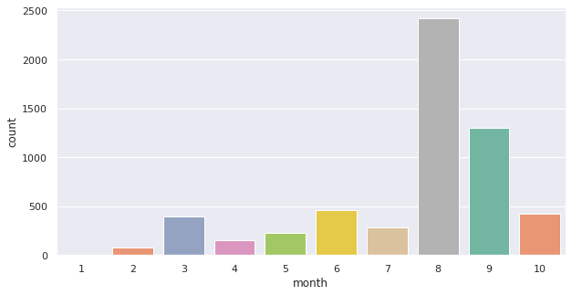
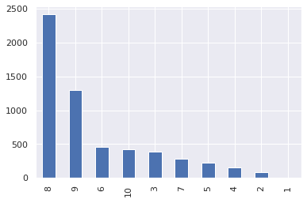
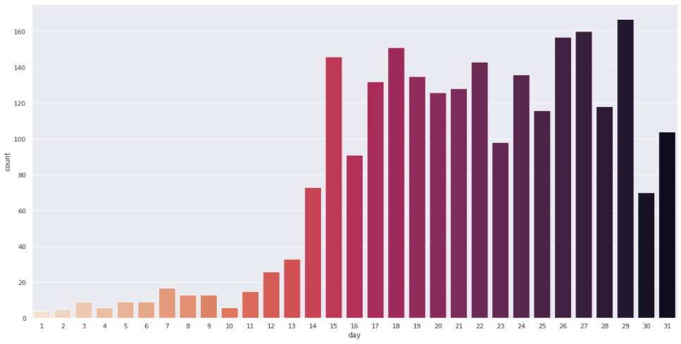
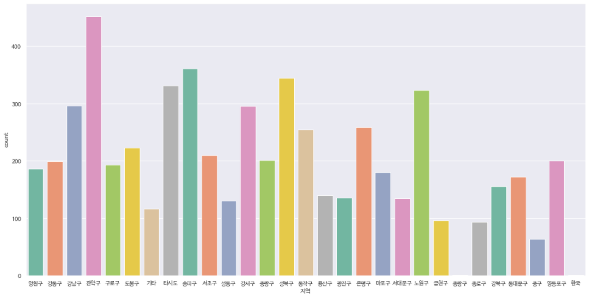
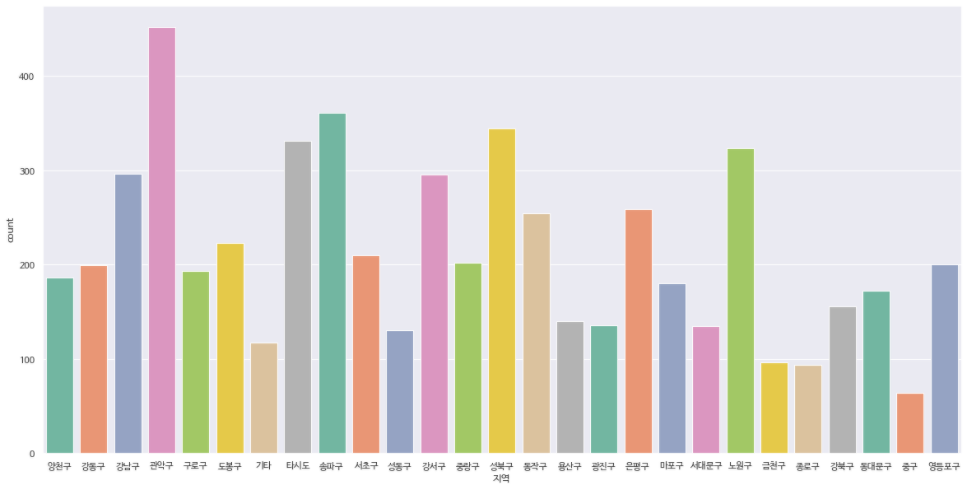

# P1 코로나 데이터 분석 프로젝트


### 1. 데이터 읽기

#### 1. 데이터 불러오기

- `pd.read_csv`

  ```python
  # pd.read_csv를 통하여 dataframe 형태로 읽어옵니다.
  corona_all=pd.read_csv("./data/서울시 코로나19 확진자 현황.csv")
  ```

  

- `pd.DataFrame.info`: 데이터 정보 확인

  ```python
  # 상위 10개 데이터를 출력합니다.
  corona_all.head(10)
  ```

  

### 2. 데이터 정제

#### 1. 비어있는 column 지우기

- `pd.DataFrame.drop`

  ```python
  # drop 함수를 사용하여 국적, 환자정보, 조치사항 coulmn 데이터를 삭제합니다.
  corona_del_col = corona_all.drop(columns = ['국적','환자정보','조치사항'])
  ```

  

### 3. 데이터 시각화

#### 1. 데이터 전처리

```python
# 전처리 전 데이터 확인
corona_del_col['확진일']
```

```
0       10.21.
1       10.21.
2       10.21.
3       10.21.
4       10.21.
         ...  
5743     1.31.
5744     1.30.
5745     1.30.
5746     1.30.
5747     1.24.
Name: 확진일, Length: 5748, dtype: object
```


```python
# dataframe에 추가하기 전, 임시로 데이터를 저장해 둘 list를 선언합니다.
month = []
day = []

# 반복문을 이용해 컬럼을 순회합니다.
for data in corona_del_col['확진일']:
    # split 함수를 사용하여 월, 일을 나누어 list에 저장합니다.
    month.append(data.split('.')[0])
    day.append(data.split('.')[1])


# corona_del_col에 `month`, `day` column을 생성하며 동시에 list에 임시 저장된 데이터를 입력합니다.
corona_del_col['month'] = month
corona_del_col['day'] = day

# astype을 이용해 데이터타입(Dtype)을 변경합니다.
# 원본의 데이터타입을 변경하는 것이 아니라, 데이터타입을 변경한 새로운 column을 리턴합니다.
corona_del_col['month'].astype('int64')
corona_del_col['day'].astype('int64')
```


#### 2. 월별 확진자 수 출력

> 나누어진 `month`의 데이터를 바탕으로 달별 확진자 수를 막대그래프로 출력해 보겠습니다.

```python
# 그래프에서 x축의 순서를 정리하기 위하여 order list를 생성합니다.
order = []
for i in range(1,11):
    order.append(str(i))

order
# ['1', '2', '3', '4', '5', '6', '7', '8', '9', '10']
```


```python
# 그래프의 사이즈를 조절합니다.
plt.figure(figsize=(10,5))

# seaborn의 countplot 함수를 사용하여 출력합니다.
# 그래프 스타일 지정
sns.set(style="darkgrid")
# 원본 데이터에서 갯수를 센 뒤 그래프를 그리는 메서드
ax = sns.countplot(x="month", data=corona_del_col, palette="Set2", order = order)
```



```python
# series의 plot 함수를 사용한 출력 방법도 있습니다.
# 1. month 컬럼에서 값(value)를 센다.
# 2. bar 형태로 그래프를 그린다.
corona_del_col['month'].value_counts().plot(kind='bar')
```



- `value_counts()`

  ```python
  # value_counts()는 각 데이터를 세어서 내림차순으로 정리하는 함수입니다.
  corona_del_col['month'].value_counts()
  ```

  ```
  8     2416
  9     1304
  6      460
  10     425
  3      391
  7      281
  5      228
  4      156
  2       80
  1        7
  Name: month, dtype: int64
  ```

  

#### 3. 8월달 일별 확진자 수 출력

> 월별 확진자 수를 출력해보면 알 수 있듯이 8월에 확진자 수가 가장 많았습니다.
>
> 이번엔 8월 동안 확진자 수가 어떻게 늘었는지 일별 확진자 수를 막대그래프로 출력해 봅시다

```python
# 그래프에서 x축의 순서를 정리하기 위하여 order list를 생성합니다.
order2 = []
for i in range(1,32):
    
    order2.append(str(i))

order2
# ['1', '2', '3', ..., '31']
```

```python
# seaborn의 countplot 함수를 사용하여 출력합니다.
plt.figure(figsize=(20,10))
sns.set(style="darkgrid")
# 8월의 데이터만 사용한다 ==> corona_del_col[corona_del_col['month'] == '8']
ax = sns.countplot(x="day", data=corona_del_col[corona_del_col['month'] == '8'], palette="rocket_r", order = order2)
```




#### 4. 지역별 확진자 수 출력

```python
corona_del_col['지역']
```

```
0       양천구
1       강동구
2       강남구
3       관악구
4       관악구
       ... 
5743    성북구
5744    마포구
5745    종로구
5746    중랑구
5747    강서구
Name: 지역, Length: 5748, dtype: object
```


```python
# 한글을 지원하는 폰트를 적용하기 위해 라이브러리 추가
import matplotlib.font_manager as fm

# 디렉토리 지정
font_dirs = ['/usr/share/fonts/truetype/nanum', ]
# 디렉토리에 있는 파일들을 저장
font_files = fm.findSystemFonts(fontpaths=font_dirs)

# 파일리스트에 담긴 폰트파일들을 적용
for font_file in font_files:
    fm.fontManager.addfont(font_file)
```


```python
plt.figure(figsize=(20,10))
# 한글 출력을 위해서 폰트 옵션을 설정합니다.
sns.set(font="NanumBarunGothic", 
        rc={"axes.unicode_minus":False},	# 축의 값이 마이너스인 경우 마이너스(-)가 깨져보이기 때문에 비활성화
        style='darkgrid')
ax = sns.countplot(x="지역", data=corona_del_col, palette="Set2")
```



##### 이상한 데이터 처리

> 위의 출력된 데이터를 보면 `종랑구`라는 잘못된 데이터와 `한국`이라는 지역과는 맞지 않는 데이터가 있음을 알 수 있습니다.
>
> 기존 지역 데이터 특성에 맞도록 `종랑구` -> `중랑구`, `한국` -> `기타`로 데이터를 변경해 봅시다.

- `DataFrame.replace({oldColumnName: newColumnName})`

```python
# replace 함수를 사용하여 해당 데이터를 변경합니다.
# 이상치가 처리된 데이터이기에 새로운 Dataframe으로 저장합니다.
corona_out_region = corona_del_col.replace({'종랑구':'중랑구', '한국':'기타'})
```

```python
# 이상치가 처리된 데이터를 다시 출력해 봅시다.
plt.figure(figsize=(20,10))
sns.set(font="NanumBarunGothic", 
        rc={"axes.unicode_minus":False},
        style='darkgrid')
ax = sns.countplot(x="지역", data=corona_out_region, palette="Set2")
```




