[TOC]


## JWT

### 로그인 시 JWT 받아오기

로그인 시 Token을 받아와야 하는 데 받아오지 못하는 문제

Token을 왜 받아오지 못할까 살펴봤다.

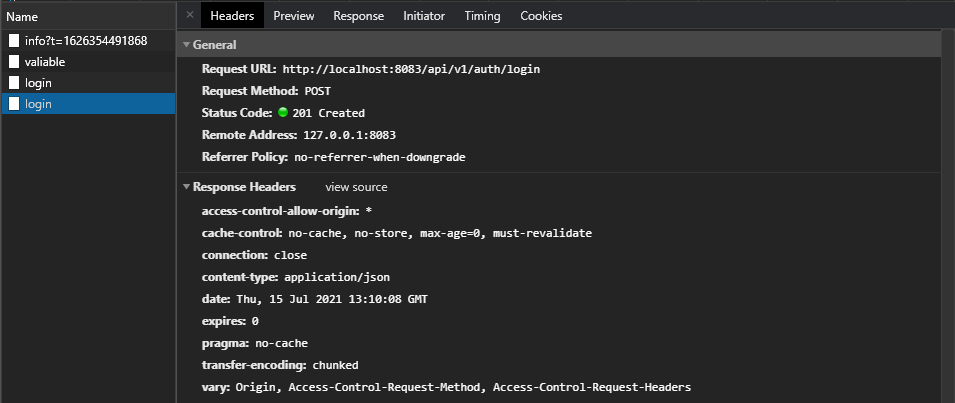

> 로그인인데 201 status code도 어색한 것 같다.

서버에서 응답은 정상적으로 하고 있었다. 그럼 어떤 내용물을 넘겨주는지 확인해보자.

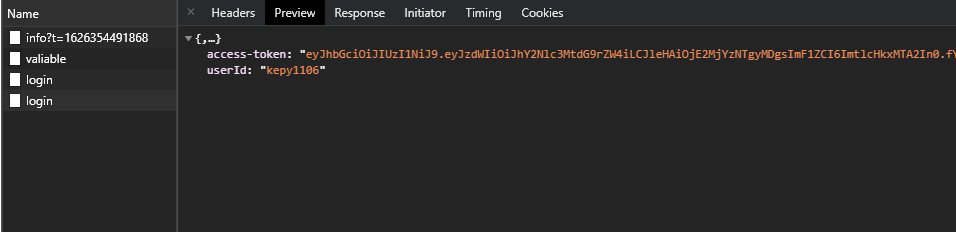

아하! 변수명이 일치되지 않아서 생기는 문제였다. 백엔드와 프론트엔드 간에 변수명 방식을 잘 맞춰놔야 하는 게 정말 중요하겠다는 생각이 들었다.


### JWT 유효성 검증

Front에서 토큰을 보내, 유효한 토큰인지 검사하는 과정을 진행하려고 했다. 하지만 반복해서 401에러가 발생했고, 어디에서 문제가 생기는지 확인해보았다.

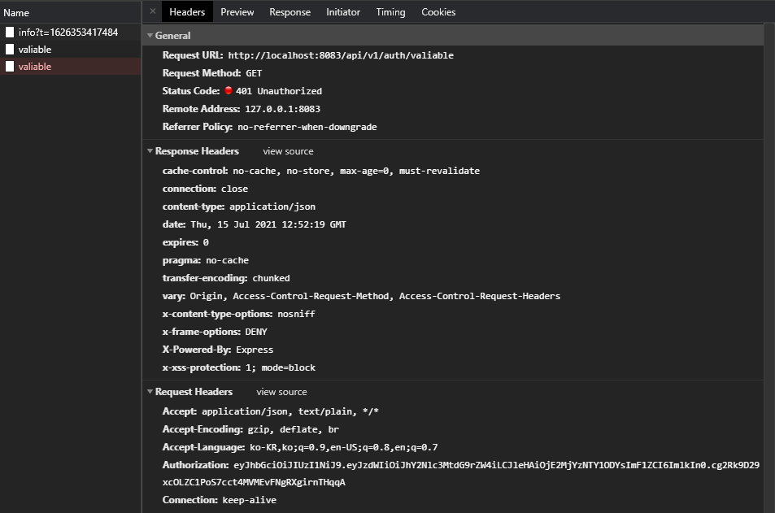

401에러라는 것은 경로 자체가 잘못된 것이 아니라는 것이었고, 나는 먼저 백엔드 코드를 살펴보았다. 토큰의 유효성을 검사하는 코드는 AuthController.java 에 있었고 다음과 같았다.


```java
@GetMapping("/valiable")
    public ResponseEntity<Map<String, Object>> valiable(HttpServletRequest request) {
        Map<String, Object> resultMap = new HashMap<>();
        HttpStatus status = HttpStatus.OK;

        if (jwtService.isUsable(request.getHeader("access-token"))) {
            logger.info("사용 가능한 토큰!!!");
        } else {
        	status = HttpStatus.UNAUTHORIZED;
            logger.error("사용 불가능 토큰!!!");
        }
        return new ResponseEntity<Map<String, Object>>(resultMap, status);
    }
```

코드를 살펴보다가 이상한 부분을 발견했다. 나는 Header에 `Authorization`이라는 이름으로 토큰 값을 넘겨주었지만, 백엔드에서는 `access-token`이라는 이름으로 찾고 있는 것이었다.

자바 코드를 한 번도 본적이 없어서 내가 틀릴 수도 있었지만, 어림짐작으로 생각해보면 Header에서 Key를 이용해 Value를 가져오는 코드일 것이라는 생각이 들었고 다음과 같이 바꿔주었다.

> 나중에 에러를 다시 구현하면서 콘솔을 확인해보았는데 출력되는 내용은 아래와 같았다.
>
> ```
> 2021-07-15 21:52:19.642 ERROR 2308 --- [nio-8080-exec-1] c.ssafy.sub1.api.service.JwtServiceImpl  : JWT String argument cannot be null or empty.
> 2021-07-15 21:52:19.643 ERROR 2308 --- [nio-8080-exec-1] c.ssafy.sub1.api.service.JwtServiceImpl  : 사용 불가능 토큰!!!
> ```
>
> JWT String으로 들어가는 값이 비어있으면 안된다는 얘기


```java
@GetMapping("/valiable")
public ResponseEntity<Map<String, Object>> valiable(HttpServletRequest request) 	{
    Map<String, Object> resultMap = new HashMap<>();
    HttpStatus status = HttpStatus.OK;

    if (jwtService.isUsable(request.getHeader("accessToken"))) {
        logger.info("사용 가능한 토큰!!!");
    } else {
        status = HttpStatus.UNAUTHORIZED;
        logger.error("사용 불가능 토큰!!!");
    }
    return new ResponseEntity<Map<String, Object>>(resultMap, status);
}
```

> access-token  > Authorization


토큰 유효성 검사 실시!

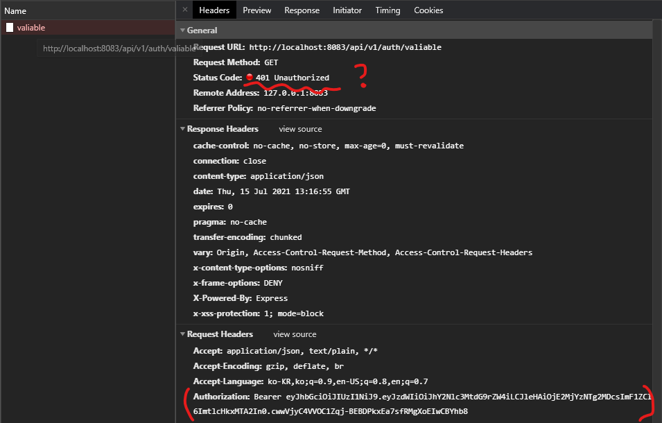

> Token 정보는 제대로 넘어가는 데, Unauthorized라니...


백엔드 콘솔을 살펴보았다.

```
2021-07-15 22:16:55.561 ERROR 2308 --- [nio-8080-exec-3] c.ssafy.sub1.api.service.JwtServiceImpl  : Unable to read JSON value: �z��&�r#�$�3#Sb
2021-07-15 22:16:55.561 ERROR 2308 --- [nio-8080-exec-3] c.ssafy.sub1.api.service.JwtServiceImpl  : 사용 불가능 토큰!!!
```

> Unable to read JSON value???


뭐가 문제인지 검색해보았고, [블로그](https://codeinlife.tistory.com/47)에서 답을 찾을 수 있었다.

> 원인: 토큰에서 들어온 토큰값이 올바르지 않을 때 발생한다. Bearer JWT 토큰을 사용하고 있다면 Bearer을 지우고 실제 토큰값만 들어오게 해야 한다.


Authorization 부분에서 토큰을 담을 때, Bearer 없이 토큰만 담았다.

```javascript
export const requestCheckToken = async ({ state }) => {
  console.log("requestCheckToken", state)
  const url = "/auth/valiable"
  return axios.get(url, {
    headers: {
      Authorization: state.token,
      // Authorization: `Bearer ${state.token}`,
    },
  })
}
```


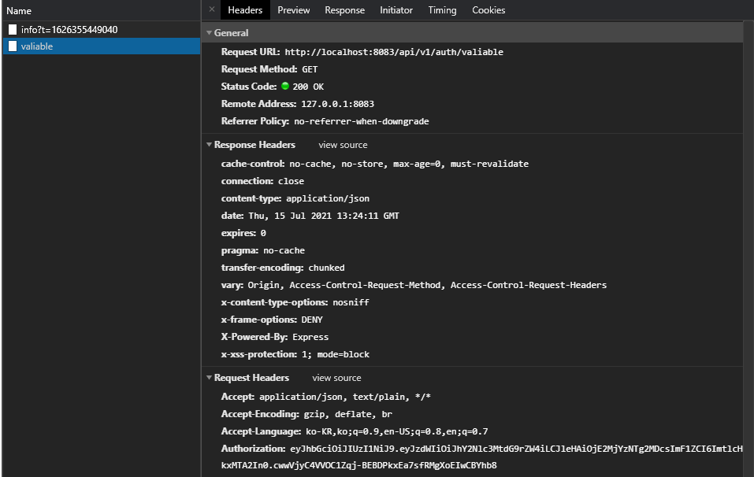

토큰이 유효한지 확인 성공!


## 문제


### Modal 닫기!

아래와 같이 모달이 활성화 되어 있을 때, 모달에 닫기 버튼을 클릭하는 것이 아닌 모달 영역 밖을 클릭 했을 때 모달이 닫히게 하려면 어떻게 해야 할까?

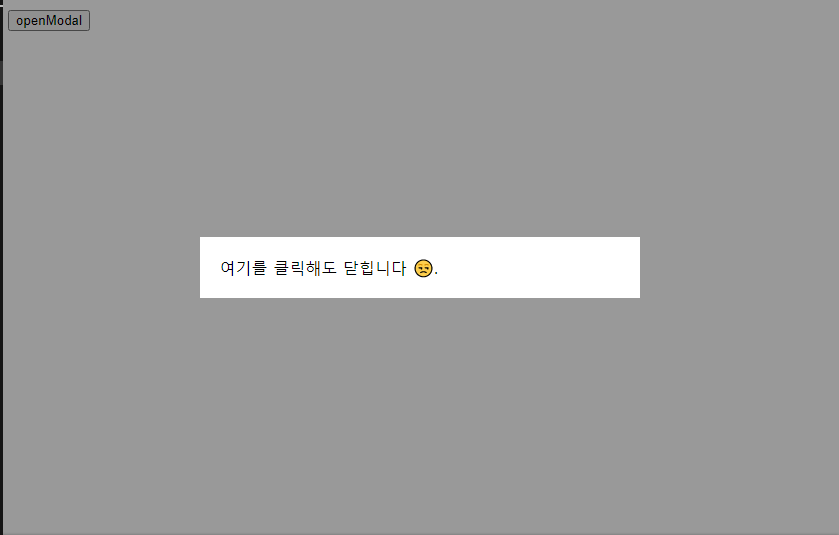

#### 기본 구조

```vue
<template>
    <div>
        <button @click="modalOpen = true">openModal</button>
    </div>
    <div class="backdrop" v-if="modalOpen" @click="modalOpen = false">
        <div class="modal-container">모달 내용</div>
    </div>
</template>
```


#### closeModal #1

> backdrop을 클릭했을 때, modal을 닫도록 해보자.

```vue
<template>
  <div>
    <button @click="modalOpen = true">openModal</button>
  </div>
  <div class="backdrop" v-if="modalOpen" @click="modalOpen = false">
    <div class="modal-container">여기를 클릭해도 닫힙니다 😒.</div>
  </div>
</template>
```


> 모달 내부 영역을 클릭해도 모달이 닫힌다.


Vue Event Modifier 중 `.self` 가 존재하는 데, `.self`는 이벤트가 일어난 요소와 이벤트가 연결된 요소가 동일한지 확인하는 과정을 거친다.

`backdrop`에 클릭 이벤트를 연결했지만, `backdrop` 내부의 `modal-container` 에서 일어난 클릭 이벤트에 의해 모달이 닫히게 된 것이기에 `.self`를 사용하면 이 문제를 해결할 수 있을 것이라고 생각했다.

#### closeModal #2

> .self 적용

<video src="README.assets/Honeycam 2021-07-22 17-51-30.webm"></video>

원하는 기능 구현에 성공했다!


## Vue Event handler


### Modifier

Vue에서 제공하고 있는 이벤트 수식어

- `.stop`
- `.prevent`
- `.capture`
- `.self`
- `.once`
- `.passive`


가장 많이 사용할 것 같은 prevent와 self만 정리해보자


#### `.prevent`

이벤트가 발생했을 때, 실행되는 기본 동작이 실행되지 않도록 합니다.

예시

- form tag의 submit 이벤트

  form tag에서 submit 이벤트가 발생하면, 다음과 같은 동작이 실행됩니다.

  1. form tag에 설정된 action, method에 의해 결정된 전달 주소로 form 내부에 입력된 데이터를 보냅니다.

     ```html
     <form action="데이터를 전달할 주소" method="데이터를 전달할 방식">
         내부 데이터
     </form>
     ```

  form의 기본 동작은 single Page Application을 구현하는 데 있어 방해가 됩니다. (페이지 이동이 강제로 일어나기 때문에)

  따라서 이런 경우에는 이벤트의 기본 동작이 실행되지 않도록 해야 하는데, vue에서는 다음과 같이 구현할 수 있습니다.

  ```vue
  <script>
  	export default {
        	setup() {
              const onSubmit = (e) => {
                  e.preventDefault()
                  // 다른 작업 수행
              }
          }
      }
  </script>
  ```

  위와 같이 구현할 수 있지만, Event Modifier를 사용하면 다음과 같이 구현할 수 있습니다.

  ```vue
  <template>
  	<form @submit.prevent = "onSubmit">
          <!-- 폼 내부 -->
      </form>
  </template>
  ```

  

#### `.self`

이벤트가 발생한 요소와 실제 이벤트가 연결된 요소가 같을 때에만 이벤트가 실행됩니다.

```vue
<template>
  <div class="button-wrapper" @click="parentOnClick">
    <p>부모 요소</p>
    <button @click="childOnClick">자식 요소</button>
  </div>
</template>
<script>
export default {
    methods: {
      parentOnClick() {
        alert("부모 요소가 클릭되었습니다");
      },
      childOnClick() {
        alert("자식 요소가 클릭되었습니다");
      }
    }
}
</script>
```

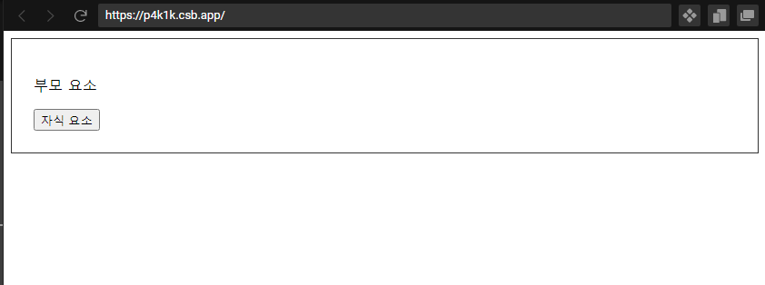


부모 요소와 자식 요소를 각각 클릭했을 때,

<video src="README.assets/Honeycam 2021-07-22 18-11-06.webm"></video>


자식 요소를 클릭했지만, 부모 요소가 차지하는 영역에서 클릭이 일어난 것이기 때문에 부모 요소에서도 클릭 이벤트가 발생하는 것이다.

`click.self`를 사용하면, 이벤트에 연결된 요소에서 이벤트가 발생해야 작동되기 때문에 이런 문제를 해결할 수 있다.

> 부모 요소에만 .self 수식어를 붙여줘도 충분하다.

```vue
<template>
  <div class="button-wrapper" @click.self="parentOnClick">
    <p>부모 요소</p>
    <button @click="childOnClick">자식 요소</button>
  </div>
</template>
```

<video src="README.assets/Honeycam 2021-07-22 18-14-48.webm"></video>


### Click vs MouseDown

click 이벤트를 통해 모달을 닫게되면, 내부에서 클릭한 상태로 드래그하여 바깥쪽에서 마우스를 떼는 순간 close 이벤트가 발생한다.

이런 상황을 막기 위해서 영역 밖에서 mousedown 이벤트가 일어났을 때에만 동작하도록 한정하면 이와 같은 문제를 피할 수 있다.


## Vue Router

### Lazy Loading Routes

JavaScript 번들 사이즈를 줄이기 위해 해당 Route에 방문했을 때, 컴포넌트를 Import 시키는 방법

> When building apps with a bundler, the JavaScript bundle can become quite large, and thus affect the page load time. It would be more efficient if we can split each route's components into a separate chunks, and only load them when the route is visited.
>
> [Vue 공식문서](https://next.router.vuejs.org/guide/advanced/lazy-loading.html#lazy-loading-routes)


### Page Not Found (경로에 해당하는 페이지가 존재하지 않을 때)

```js
// router/index.js

const routes = [
	// ...
    {
        path: "/:catchAll(.*)",
        name: "NotFound",
        component: NotFound,
    }
]
```

path에서 모든 주소를 받아들일 수 있는 Dynamic Routing을 사용하여, 위에 있는 route들과 일치하지 않는 주소를 처리한다.


### 뒤로가기 구현

```vue
<script>
	import {useRouter} from "vue-router"
    export default {
        setup() {
            const router = useRouter()
            const back = () => {
                router.go(-1)
            }
        }
    }
</script>
```


## vue.config.js


### devServer

> development 환경에서 서버가 실행되고 있을 때의 설정 내용을 담는 Object


#### devServer.https

> 기본적으로 dev-server는 HTTP 환경에서 동작한다. 이 설정을 통해 HTTP/2 (HTTPS) 환경에서 동작하도록 할 수 있다.

```js
module.exports = {
    //...
    devServer: {
        // https: false,
        https: true,
    }
}
```


https 적용 전

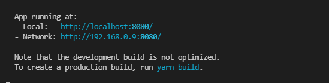

https 적용 후

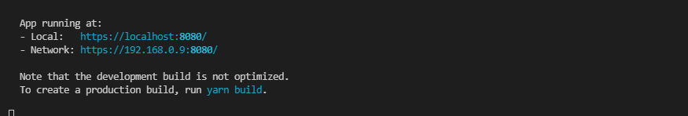

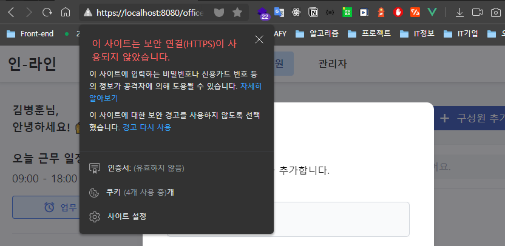


#### devServer.open

> 서버가 실행되고 난 뒤, 브라우저 창이 자동으로 뜨도록(실행된 서버 주소를 접근하는) 하는 설정

```js
module.exports = {
    //...
    devServer: {
        // open: false
        open: true,
    }
}
```


#### devServer.port

> 요청 받을 포트를 지정하는 옵션

```js
module.exports = {
    //...
    devServer: {
        port: 8888,
    }
}
```

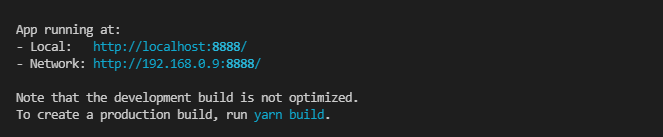


#### devServer.proxy

> 백엔드 서버가 분리되어 있고, 어떤 도메인(`/api/v1`)을 통해 API 요청을 보내려고 한다면 프록시를 사용하는 것이 유용할 수 있다.

```
백엔드 서버: http://localhost:3000
프론트엔드 서버: http://localhost:8080
API 요청 도메인
	/api/v1
```

```js
module.exports = {
    //...
    devServer: {
        proxy: {
            '/api/v1': {
                target: "http://localhost:3000",
            },
        }
    }
}
```


```vue
<script>
//...
export default {
    //...
    setup() {
        const notifications = ref([])
        const getNotifications = async() => {
            const res = await axios({
                url: "/api/v1/notifications",
            })
        }
    }
}
</script>
```


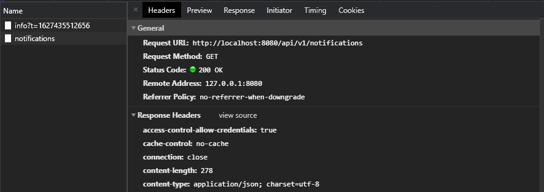

