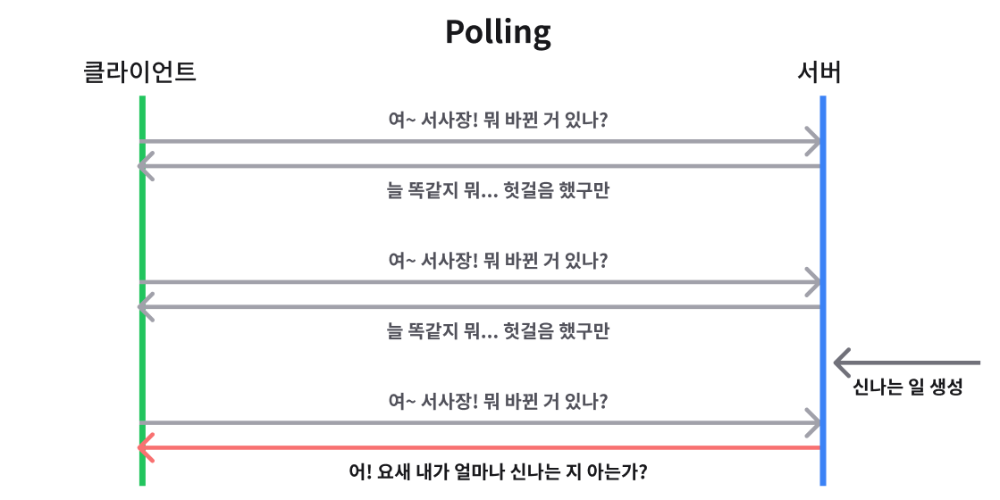
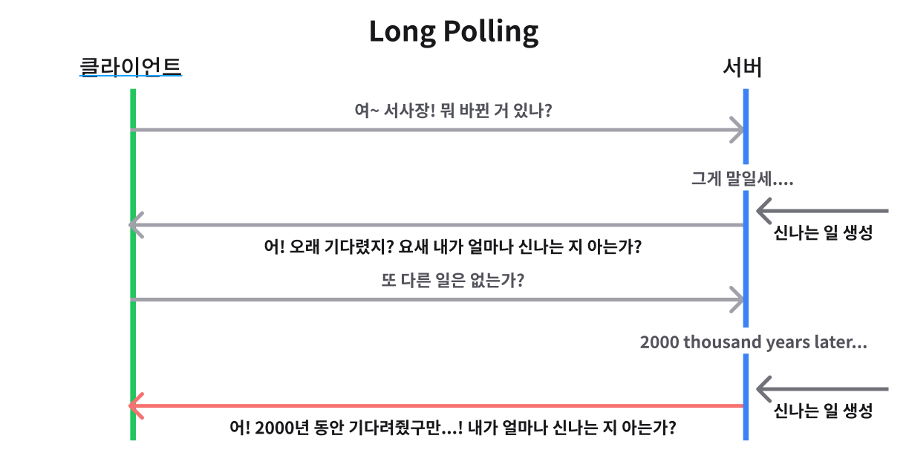
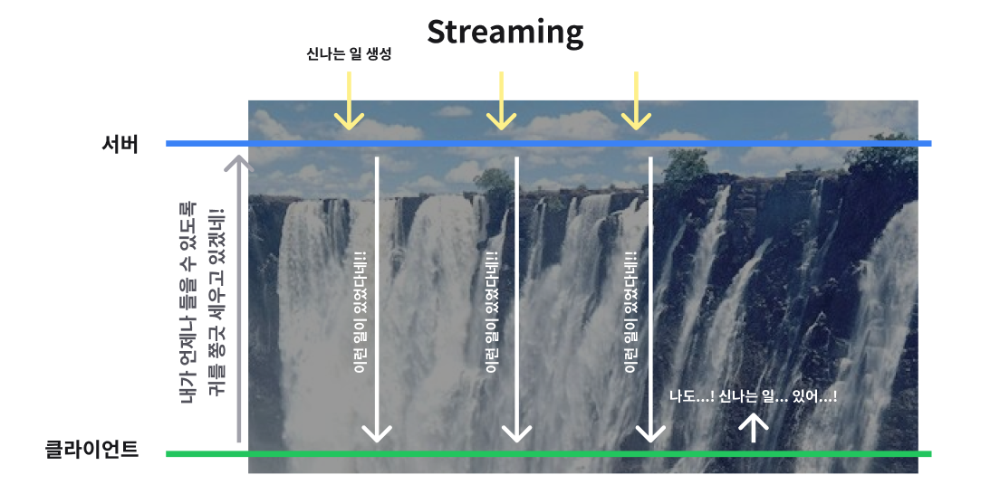

# WebSocket

웹 소켓이란?

두 프로그램 간의 메세지를 교환하기 위한 통신 방법 중 하나이다.

## 웹 소켓의 특징

1. 양방향 통신 (Full-Duplex)

   - **데이터 송수신을 동시**에 처리할 수 있는 통신 방법
   - 클라이언트와 서버가 서로에게 원할 때, 데이터를 주고 받을 수 있다.

   > 통상적인 Http 통신은 Client가 요청을 보내는 경우에만 Server가 응답하는 단방향 방식이다.

2. 실시간 네트워킹 (Real Time-Networking)

   > 빠르게 서로의 상태를 업데이트 한다.

   - 웹 환경에서 연속된 데이터를 빠르게 노출
   - 여러 단말기에서 빠르게 데이터를 교환 (동기화)

   - Ex) 채팅, 주식, 화상회의(비디오) 등

## 웹 소켓 이전

### Polling

일정한 주기를 갖고 서버에 "**업데이트(동기화) 할 데이터가 있는지**" 확인한다.

업데이트 할 데이터가 없는데에도 요청을 보내는 경우가 발생할 수 있기 때문에 이 경우 "**불필요한 request와 connection**"이 생성된다.

확인하는 주기보다 서버에서 업데이트 할 일이 더 자주 생긴다면, 실시간이라고 할 수 없음

### Long Polling

서버에 요청을 보내고, 이벤트가 생겨 응답 받을 때 까지 연결을 끊지 않는다 (업데이트가 없다는 응답도 받지 않는 듯).

서버로부터 응답을 받은 뒤에는 서버에 재요청을 보낸다.

### Streaming

클라이언트는 서버에 요청을 보낸 뒤 끊기지 않은 연결 상태에서 끊임없이 서버로부터 데이터를 수신받는다.

HTTP는 단방향 통신만 가능하기 때문에 클라이언트에서 서버로의 데이터 송신이 어렵다.

