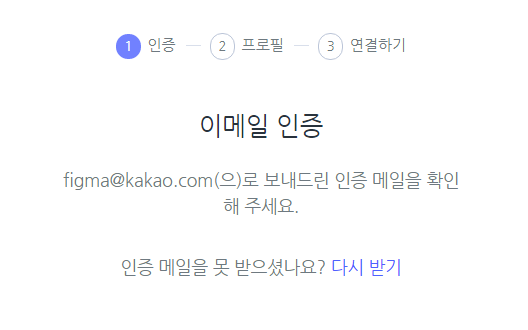
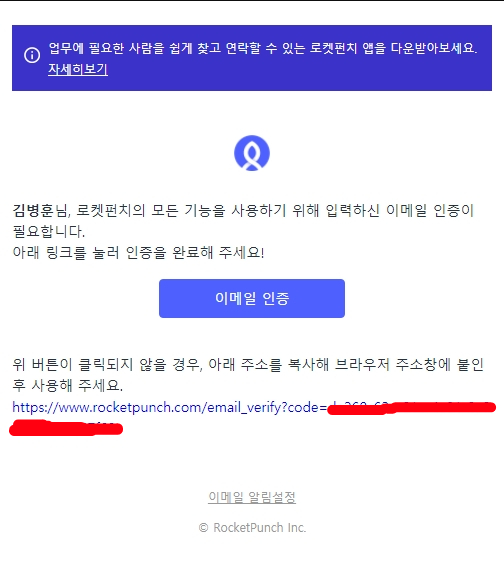
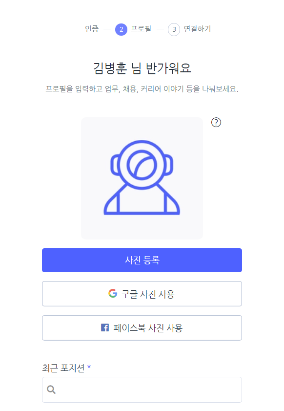
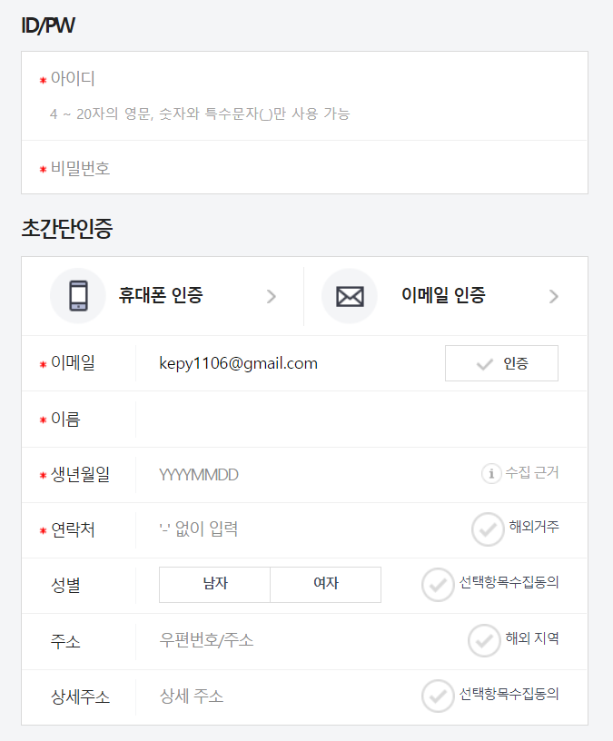
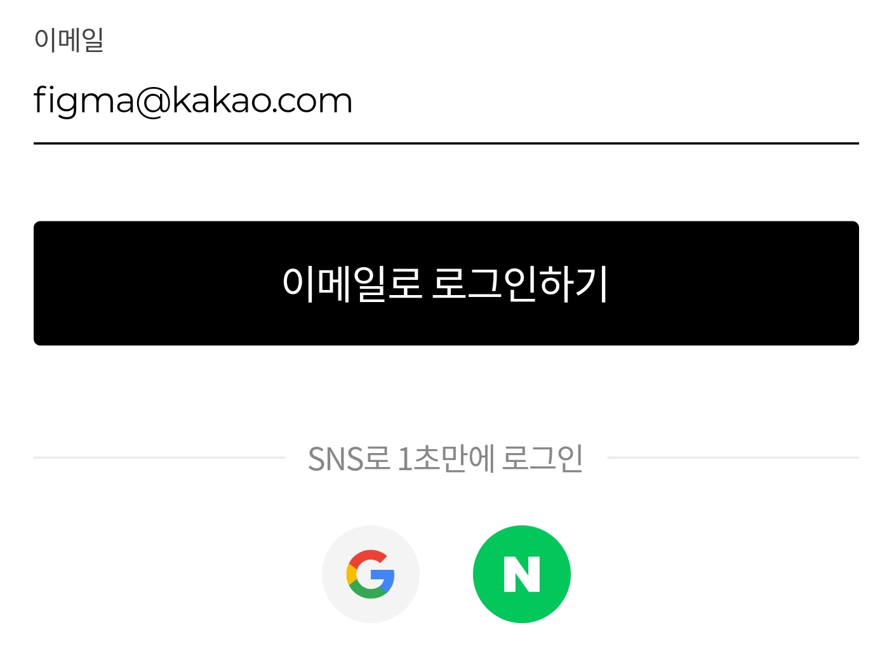
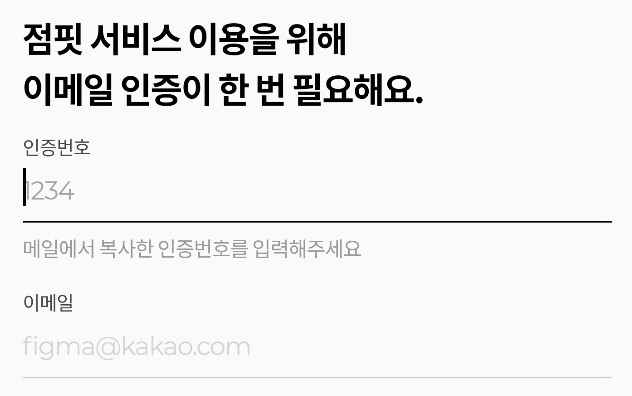
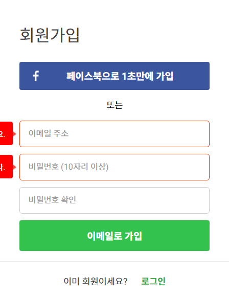
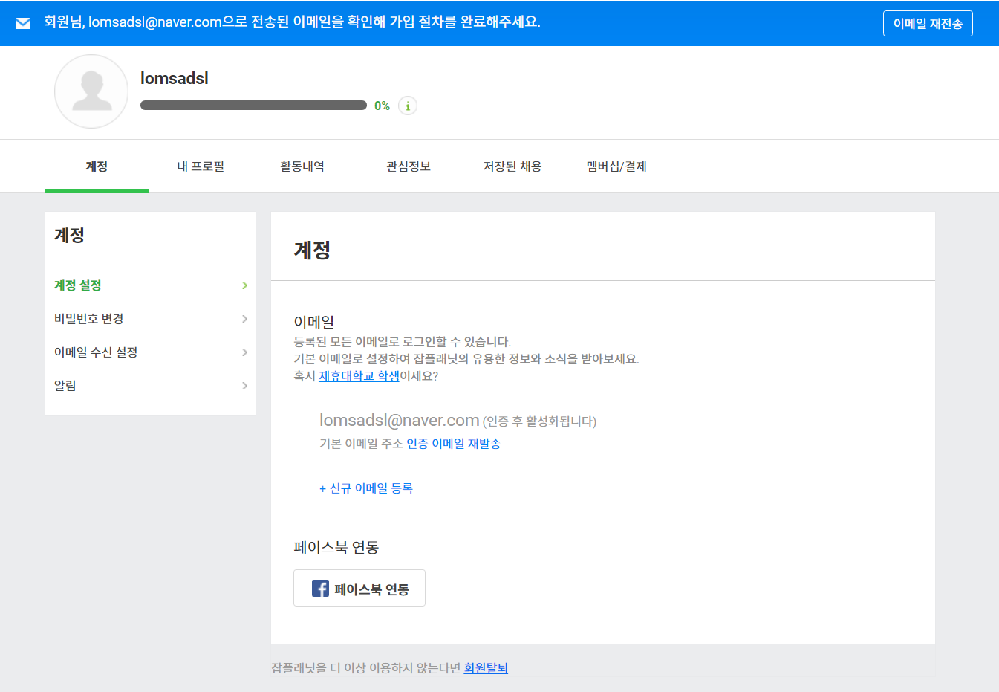

### 블록체인

- 블록체인은 보안성, 투명성, 무결성, `탈중앙화`의 특징을 가지고 있고, 이 특징으로 여러가지 어플리케이션을 활용할 수 있다.

- 블록체인의 네트워크는 기본적으로 `P2P` 네트워크에서 작동한다.
- 암호화에는 복호화 가능 암호화, 단방향 암호화로 나눠지고, 단방향 암호화는 해시함수로, `sha256`, keccak256등이 있다.
- 암호화에 서명과 확인을 이용해 메시지의 무결성과 송신자를 보증하는 알고리즘을 `전자서명`이라고 한다.
- `ECC` 암호화 알고리즘은 공개키 암호화로 타원 곡선 함수를 이용하여 암호화 한다.

# 이메일 인증

사이드 프로젝트를 진행하던 중 이메일 인증 부분을 디자인 하다가 문득 든 생각

> 이메일 인증을 회원가입 중간에 하는 서비스들도 있고, 회원가입 끝나고 하는 서비스도 있던 것 같은데, 내가 만들려고 하는 서비스와 비슷한 서비스들은 어떤 흐름으로 회원가입을 설계해놓았을까?

## 요약

| 이름         | 이메일 인증이 필요한가? | 이메일 인증을 언제 진행하는가? | 이메일 인증을 어떻게 하는가? |
| ------------ | ----------------------- | ------------------------------ | ---------------------------- |
| 로켓펀치     | ✅                       | 회원가입 중간 단계             | 콜백링크                     |
| 사람인       | ✅                       | 회원가입 중간 단계             | 인증코드                     |
| 점핏         | ✅                       | 회원가입 중간 단계             | 인증코드                     |
| 잡플래닛     | ✅                       | 회원가입 완료 후               | 콜백링크                     |
| 원티드       | ⬜                       |                                |                              |
| 프로그래머스 | ✅                       | 회원가입 완료 후               | 콜백링크                     |

## 채용 관련 서비스

### 1. 로켓펀치

#### 회원가입 방식

- 일반 회원가입
  - 이메일로 회원가입
  - 휴대전화로 회원가입
- SNS로 회원가입
  - 구글
  - 페이스북

#### 회원가입 과정

1. 기본정보 입력

   입력 요소: 이메일, 비밀번호, 성, 이름

2. 이메일 인증

   1. 인증 메일 발송

      

      

   2. 콜백링크를 통해 이메일 인증 완료

3. 추가정보(프로필) 입력

   

#### 특이사항

1. 이메일 회원가입 시, 성과 이름을 나누어 받는다.
2. 이메일 회원가입 시, 확인 비밀번호를 받지 않는다.
3. 회원가입 중 이메일 인증을 진행한다.
4. 인증 메일에 있는 콜백링크를 통해 이메일을 인증한다.

### 2. 사람인

#### 회원가입 방식

- 일반 회원가입
  - 인증 방식이 나눠진다.
    - 휴대폰 인증
    - 이메일 인증
- SNS 회원가입
  - 네이버
  - 페이스북
  - 카카오
  - 구글
  - 애플

#### 회원가입 과정

단일 과정으로 진행된다.

이메일을 입력하고, 인증버튼을 누르면 인증코드가 담긴 메일이 발송된다.

#### 특이사항

1. 확인 비밀번호를 받지 않는다.
2. 이메일 인증을 하지만, 이메일로 로그인하지 않고 별도의 아이디로 로그인한다.
3. 회원가입 중 이메일 인증을 진행한다.
4. 인증 메일에 있는 인증 코드를 통해 이메일을 인증한다.

### 3. 점핏

#### 회원가입 방식

- 일반 회원가입
  - 이메일로 회원가입
- SNS 회원가입
  - 구글
  - 네이버

#### 회원가입 과정

1. 이메일 입력

   

2. 이메일 인증

   

   1. 인증 메일 발송
   2. 인증 코드 입력

3. 추가 정보 입력

   - 이름
   - 비밀번호

#### 특이사항

1. 회원가입 중간에 이메일 인증을 진행한다.
2. 인증 메일에 있는 인증 코드를 통해 이메일을 인증한다.

### 4. 잡플래닛

#### 회원가입 방식

- 일반 회원가입
  - 이메일 회원가입
- SNS 회원가입
  - 페이스북

#### 회원가입 과정

1. 이메일, 비밀번호 입력

   

2. 이용약관 동의

3. 추가 정보 입력

4. 회원가입 완료

5. 인증 메일 발송

   

