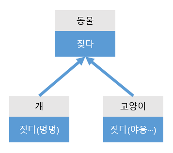

# 소프트웨어 생명 주기

소프트웨어를 개발하기 위해 필요한 기획, 개발, 운용, 유지보수 등의 과정을 단계별로 나눈 것


## 소프트웨어 생명 주기 모형

소프트웨어 생명 주기를 추상화한 틀

### 폭포수 모형

- 순차적인 단계를 밟아 나가되 뒤로 돌아가지 않는다.
- 해당 과정을 완료한 뒤 다음 단계로 넘어간다.
- 예측 가능한 결과물을 만들어 낸다.
- 해당 과정을 완료했을 때, 명확한 결과물이 산출되어야 한다.

### 애자일 모형

- 스프린트, 이터레이션이라고 불리는 짧은 개발 주기를 반복한다.
- 한 주기가 끝나고, 고객의 평가와 요구를 적극 수용한다.
- 고객에게 초점을 맞추며 개발해나가는 방식

| 구분                 | 폭포수 모형                  | 애자일 모형                |
| -------------------- | ---------------------------- | -------------------------- |
| 새로운 요구사항 반영 | 어려움                       | 개발 주기 단위로 반영 가능 |
| 고객과의 의사소통    | 적음                         | 개발 주기 단위로 소통      |
| 테스트               | 개발 완료 단계에 테스트 진행 | 개발 주기 단위로 테스트    |
| 개발 중심            | 계획, 문서 (메뉴얼)          | 고객                       |


# 소프트웨어 아키텍처

> 소프트웨어의 골격이 되는 기본 구조
> 소프트웨어를 구성하는 요소들 간의 관계를 표현하는 구조

- 애플리케이션의 분할 방법과 분할된 모듈에 할당할 기능, 모듈 간 인터페이스 등을 결정한다.
- 소프트웨어 아키텍처 설계의 기본 원리
  - 모듈화
  - 추상화
  - 단계적 분해
  - 정보은닉

|           | 상위 설계              | 하위 설계                     |
| --------- | ---------------------- | ----------------------------- |
| 별칭      | 아키텍처 설계          | 모듈 설계                     |
| 설계 대상 | 시스템의 전체적인 구조 | 시스템 내부 구조 및 행위      |
| 세부 목록 | 구조, DB, 인터페이스   | 컴포넌트, 자료 구조, 알고리즘 |


## 모듈화

> 시스템 기능들을 모듈 단위로 나누는 것을 의미한다.
>
> 관심사 분리를 통해 시스템 확장, 수정 등 유지보수 시 유용하다.

- 특징
  - 자주 사용되는 계산식이나 사용자 인증과 같은 기능을 공통 모듈로 구성하여, **프로젝트의 재사용성을 높일 수 있다.**
  - 모듈의 크기를 너무 작게 나누면 => 모듈 간, 통합하는 데 비용이 많이 든다.
  - 모듈의 크기를 너무 크게 나누면 => 한 모듈을 생산하는 데 비용이 많이 든다.

## 추상화

> 필요한 핵심 정보 및 동작을 구체화하여 표현하는 것

- 추상화 유형

  - 과정 추상화

    자세한 수행 과정을 정의하지 않고, 전반적인 흐름을 확인할 수 있도록 설계하는 방법

    ex) 기획 => 개발 => 테스트 => 검증

  - 데이터 추상화

    데이터의 세부적인 속성이나 용도를 정의하지 않고, 데이터 구조를 대표할 수 있는 표현으로 대체하는 방법

    ex) 김병훈에 대한 정보 (나이, 전화번호, 출생지, 사는 곳, 이름, 이메일, 게임 실력, 친구 관계 등) 중 필요한 내용(이름, 이메일)만 구체화

  - 제어 추상화

    이벤트 발생의 정확한 절차나 방법을 정의하지 않고, 대표할 수 있는 표현으로 대체하는 방법

## 정보 은닉

> 한 모듈 내부에 포함된 상태, 동작 관련 정보가 감추어져, **다른 모듈에서 접근하지 못하도록** 하는 기법

- 정보 은닉된 모듈과 소통할 때에는 해당 모듈에서 허가한 정보만 접근이 가능하도록 인터페이스를 설계한다.
- 하나의 모듈이 변결되더라도 다른 모듈에 영향을 주지 않는다. (?)


# 아키텍처 패턴

> 아키텍처를 설계할 때, 참조할 수 있는 전형적인 해결 방식 또는 예제
> => 사람들이 많이 쓰는 방식

- 특징
  - 검증된 구조
  - 팀원들이 서로 알고 있는 내용
  - 결과 예측 가능
  - 구조에 대한 이해가 쉽다.

- 장점
  - 시행착오를 줄일 수 있다.
  - 안정적인 개발이 가능하다.
  - 의사소통이 편해진다.

## MVC 패턴

> 서브 시스템을 Model - View - Controller 3개의 부분으로 구조화하는 패턴

- Model: 데이터를 담당
- View: 사용자에게 보이는 화면 (DOM)을 담당
- Controller: View와 Model을 연결, 사용자로부터 받은 입력(이벤트)을 처리한다.


# 객체지향

> 현실에 있는 개체(Entity)를 코드 상에서 하나의 객체(Object)로 만들고, 그 객체들을 활용하여 프로그램을 만드는 방법이다.

- 각 객체 별로 담당하고 있는 역할이 있기에 관심사 분리가 이루어진다. 따라서, 재사용 및 확장에 용이하고, 개발 및 유지보수의 난이도를 낮춰준다.
- 복잡한 구조를 단계적 / 계층적으로 표현한다.
- 주요 구성 요소 및 개념
  - 객체 (Object)
  - 클래스 (Class)
  - 캡슐화 (Encapsulation)
  - 상속 (Inheritance)
  - 다형성 (Polymorphism)
  - 연관성 (Relationship)


## 객체

> 데이터(프로퍼티)와 데이터를 처리하는 함수(메서드)를 묶어 놓은(캡슐화) 하나의 소프트웨어 모듈이다.

- 데이터 (프로퍼티)

  객체가 가지고 있는 상태를 나타낸다.

- 함수 (메서드)

  객체가 수행하는 동작(기능)으로 객체가 가지고 있는 데이터를 처리하는 알고리즘이다.


## 클래스

> 공통된 속성(프로퍼티)과 연산(메서드)를 갖는 객체의 집합으로, 객체의 일반적인 타입을 의미한다.

- 각각의 객체(인스턴스)들이 갖는 속성과 연산을 정의하고 있는 틀이다.
- 객체지향 프로그래밍에서 데이터(개체)를 추상화 하는 단위이다.
- 클래스에 속한 각각의 객체를 **인스턴스**라 하며, 클래스로부터 새로운 객체(인스턴스)를 생성하는 것을 **인스턴스화**라 한다.
- 동일한 클래스에 속한 각각의 객체는 클래스에서 정의한 공통의 속성과 행위를 가지고 있다.


## 캡슐화

> 데이터(프로퍼티)와 데이터를 처리하는 함수(메서드)를 하나로 묶는 것

- 캡슐화된 객체는 관리하는 데이터와 함수가 은폐(정보 은닉)되어 인터페이스를 통해 공개한 것 외에는 접근이 제한된다. 따라서, 외부 모듈 변경으로 인한 파급력이 적다. (느슨한 연결)
- 재사용이 용이하다.
- 객체 간 소통 시, 소통할 상대 객체에 대한 세부 내용 (어떻게 동작하는지)은 알 필요가 없으므로 인터페이스가 단순해지고, 객체 간 결합도가 낮아진다.

```js
class CoffeeMachine {
    constructor() {
        this.coffee = {}
    }
    addCoffee(name, price) {
        this.coffee[name] = price
    }
    getCoffee(name, money) {
        return [name, money - this.coffee[name]]
    }
}
```


## 상속

> 정의되어 있는 상위 클래스(부모 클래스)의 모든 속성(프로퍼티)과 연산(메서드)를 물려받는 것

- 부모 클래스에 정의된 내용을 재정의하지 않아도 된다. (중복된 코드 작성을 방지)
- 상속받은 내용 외에 새로운 속성 / 연산을 정의할 수 있다.

```js
class SubCoffeeMachine extends CoffeeMachine {
    constructor() {
        super()
    }
    // addCoffee
    // getCoffee
    clean() {
        alert("청소가 완료되었습니다")
    }
}
```


## 다형성

> 메세지에 의해 객체(클래스)가 연산을 수행할 때, 하나의 메세지에 대해 여러가지 형태로 응답할 수 있는 능력



## 연관성

> 두 개 이상의 객체들이 상호 참조하는 관계를 말한다.
